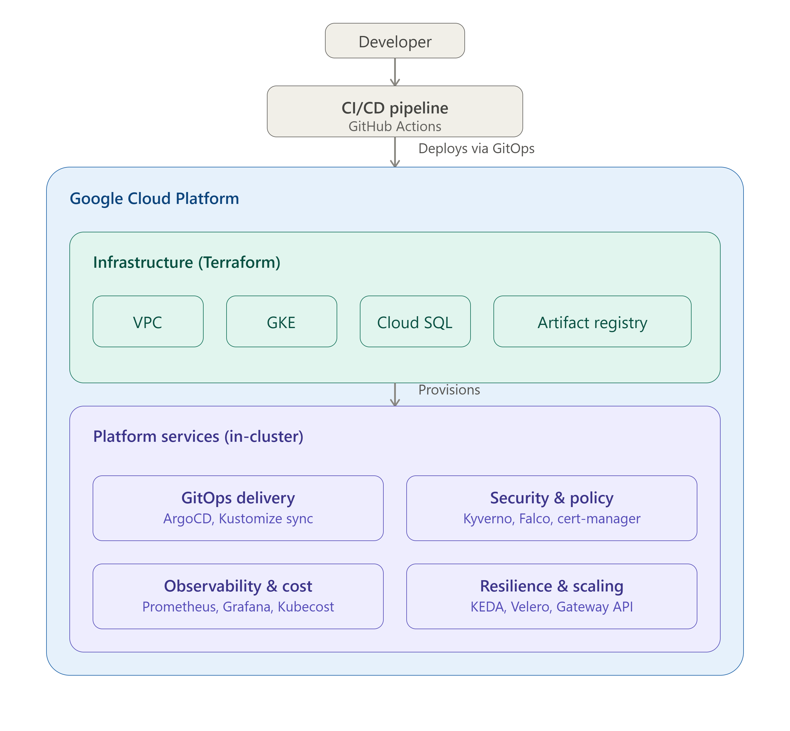

## Project Overview

This Platform Engineering Portfolio demonstrates the design, provisioning, deployment, security, and operation of a production-ready cloud-native application platform on Google Cloud Platform (GCP). The project follows modern Platform Engineering principles by separating infrastructure provisioning, platform services, application delivery, and operational automation into dedicated repositories.

The platform is built using Infrastructure as Code (Terraform) to provision cloud resources such as Virtual Private Cloud (VPC), Google Kubernetes Engine (GKE), Cloud SQL, Artifact Registry, Identity and Access Management (IAM), and Cloud Storage. Shared Kubernetes platform services including ArgoCD, External Secrets, Kyverno, Cert-Manager, Prometheus, Grafana, Kubecost, Falco, KEDA, Velero, and Gateway API are deployed as reusable platform components.

Application delivery follows a GitOps workflow using ArgoCD and Kustomize, enabling declarative, version-controlled deployments across multiple environments. CI pipelines are implemented with GitHub Actions to automate source code validation, testing, container image builds, vulnerability scanning, SBOM generation, image signing, and deployment updates.

Security is integrated throughout the platform using policy enforcement, runtime security, secrets management, network segmentation, and container image verification. Observability is provided through centralized monitoring, metrics collection, alerting, and cost visibility.

The portfolio demonstrates a complete Platform Engineering lifecycle, covering infrastructure provisioning, platform management, application deployment, security, observability, automation, and progressive delivery using production-oriented engineering practices.

---
## Solution Architecture

The following architecture illustrates the complete platform deployment on GCP.



This platform is built on a layered architecture that cleanly separates infrastructure provisioning, platform services, application delivery, and operations. Each layer owns a single responsibility, which keeps the system modular, independently scalable, and easier to secure and maintain as it grows.

The entire stack runs on Google Cloud Platform (GCP) and is built around modern Platform Engineering and GitOps principles — infrastructure, Kubernetes platform services, application deployments, security, and observability are all automated rather than manually operated.

Architecture at a glance

| Layer | Responsibility | Key Technologies |
|-------|----------------|------------------|
| **Infrastructure** | Cloud foundation and networking | Terraform, Google Cloud Platform (GCP), VPC, GKE, Cloud SQL, Artifact Registry |
| **Platform** | Shared Kubernetes platform services | ArgoCD, Argo Rollouts, Gateway API, Kyverno, Falco |
| **GitOps** | Declarative, version-controlled application delivery | ArgoCD, Kustomize |
| **Application** | Cloud-native microservices | Vote Service, Result Service, Worker Service, PostgreSQL, Redis |
| **CI/CD** | Build, test, secure, and deploy applications | GitHub Actions, Trivy, Cosign, SBOM, Artifact Registry |
| **Security** | Defense-in-depth and policy enforcement | Kyverno, Kubernetes RBAC, Workload Identity, Falco |
| **Observability** | Monitoring, dashboards, and alerting | Prometheus, Grafana, Alertmanager |
| **Platform Automation** | Operational automation and self-healing | Python-based automation services |


## Platform Layers

### 1. Infrastructure Layer

The **Infrastructure Layer** is fully provisioned using **Terraform**, providing the cloud foundation required to operate the platform.

It provisions:

- VPC 
- Cloud Router and Cloud NAT for controlled outbound access
- Firewall rules
- IAM roles and Workload Identity Federation
- Google Kubernetes Engine (GKE)
- Cloud SQL (PostgreSQL)
- Artifact Registry
- Cloud Storage
- Service Accounts

Infrastructure is organized into reusable Terraform modules, enabling consistent deployments across **Development** and **Production** environments by reusing the same modules with environment-specific variables.

---

### 2. Platform Layer

After the Kubernetes cluster is provisioned, the **Platform Layer** installs the shared services required by application teams.

Platform components include:

- ArgoCD
- Argo Rollouts
- Gateway API
- NGINX Gateway Fabric
- Cert-Manager
- External Secrets Operator
- Kyverno
- Falco
- Prometheus
- Grafana
- Alertmanager
- Kubecost
- KEDA
- Velero
- Reloader

These services transform a standard Kubernetes cluster into a production-ready Internal Developer Platform (IDP).

---

### 3. GitOps Layer

Application delivery follows a **GitOps** workflow where all deployment changes are managed through Git. Direct deployments to the Kubernetes cluster are not permitted.

**ArgoCD** continuously reconciles the desired state stored in Git with the live cluster state.

#### GitOps Capabilities

- Declarative, version-controlled deployments
- Automatic synchronization and drift detection
- One-command rollback
- Environment promotion using Kustomize overlays

---

### 4. Application Layer

The platform hosts a cloud-native microservices application consisting of:

- Vote Service
- Result Service
- Worker Service
- PostgreSQL
- Redis

Application manifests are managed using **Kustomize**, with separate overlays for each environment.

Progressive delivery is implemented using **Argo Rollouts**, supporting:

- Canary Deployments
- Blue-Green Deployments

---

### 5. CI/CD Layer

Continuous Integration is implemented using **GitHub Actions**.

The pipeline performs:

1. Source code checkout
2. Dependency installation
3. Unit testing
4. Docker image build
5. Trivy vulnerability scanning
6. SBOM generation
7. Cosign image signing
8. Push image to Artifact Registry
9. Update GitOps manifests automatically

Once the GitOps repository is updated, **ArgoCD** automatically synchronizes the cluster with the latest application version.

---

### 6. Security Layer

Security is integrated throughout the platform using a DevSecOps approach.

Key security capabilities include:

- Kyverno policy enforcement
- Pod Security Standards (PSS)
- Kubernetes Network Policies
- Role-Based Access Control (RBAC)
- External Secrets Operator
- Workload Identity Federation
- Trivy image vulnerability scanning
- Software Bill of Materials (SBOM)
- Cosign container image signing
- Falco runtime threat detection

These controls ensure workloads comply with organizational security policies before reaching production.

---

### 7. Observability Layer

Platform observability is powered by:

- Prometheus
- Grafana
- Alertmanager

Monitoring includes:

- Kubernetes cluster metrics
- Application metrics
- Redis exporter metrics
- PostgreSQL exporter metrics
- ServiceMonitors
- Alerting rules
- Grafana dashboards

This provides comprehensive visibility into platform health, application performance, and infrastructure utilization.

---

### 8. Platform Automation Layer

Operational tasks are automated using Python-based services.

Automation includes:

- Daily platform health reports
- Cluster health validation
- Infrastructure reporting
- Scheduled maintenance tasks
- Operational self-healing workflows

These automation services reduce manual effort, improve platform reliability, and streamline day-to-day operations.

Architectural principles

- Infrastructure as Code (Terraform)
- GitOps-driven continuous delivery
- Immutable infrastructure
- Declarative Kubernetes configuration
- Platform self-service
- Security by default & policy as code
- Progressive delivery
- Infrastructure reusability across environments
- Production-grade observability
- Automated platform operations
---

## Technology Stack

| Category | Technologies |
|----------|--------------|
| **Cloud Platform** | Google Cloud Platform (GCP), Virtual Private Cloud (VPC), Cloud Router, Cloud NAT, Cloud Storage, Cloud SQL (PostgreSQL), Artifact Registry |
| **Infrastructure as Code** | Terraform |
| **Container Platform** | Docker, Google Kubernetes Engine (GKE) |
| **GitOps & Continuous Delivery** | ArgoCD, Argo Rollouts, Kustomize |
| **CI/CD** | GitHub Actions |
| **Traffic Management** | Gateway API, NGINX Gateway Fabric |
| **Security** | Kyverno, Falco, Workload Identity Federation, Kubernetes RBAC, Pod Security Standards (PSS), External Secrets Operator, Cosign, Trivy, SBOM |
| **Secrets & Certificates** | Vault, External Secrets Operator, Google Secret Manager, Cert-Manager, Let's Encrypt |
| **Observability** | Prometheus, Grafana, Alertmanager |
| **Autoscaling** | KEDA, Horizontal Pod Autoscaler (HPA), Cluster Autoscaler |
| **Cost Management** | Kubecost |
| **Backup & Disaster Recovery** | Velero |
| **Configuration Management** | Reloader |
| **Databases & Messaging** | PostgreSQL (Cloud SQL), Redis |
| **Programming Languages** | Python, YAML, Bash |
| **Version Control** | Git, GitHub |
---

## Key Capabilities

- **Infrastructure as Code (IaC)** – Provision and manage cloud infrastructure using reusable Terraform modules with environment-specific configurations.

- **Production-Ready Kubernetes Platform** – Deploy a secure and scalable Google Kubernetes Engine (GKE) platform with shared services and standardized operational practices.

- **GitOps-Based Continuous Delivery** – Enable declarative, version-controlled deployments with ArgoCD, automated synchronization, drift detection, and environment promotion through Kustomize overlays.

- **Automated CI/CD Pipelines** – Build, test, scan, sign, and publish container images using GitHub Actions, integrating security checks into every deployment.

- **Progressive Delivery** – Perform Canary and Blue-Green deployments with Argo Rollouts to reduce deployment risk and support safe application releases.

- **Policy-Driven Security** – Enforce Kubernetes best practices using Kyverno, Pod Security Standards (PSS), RBAC, Workload Identity Federation, and runtime security with Falco.

- **Supply Chain Security** – Integrate vulnerability scanning with Trivy, generate Software Bill of Materials (SBOM), and sign container images using Cosign to strengthen software supply chain integrity.

- **Secrets & Certificate Management** – Securely manage application secrets with External Secrets Operator, vault and Google Secret Manager, while automating TLS certificate issuance and renewal with Cert-Manager.

- **Traffic Management & Networking** – Implement modern Kubernetes networking using Gateway API and NGINX Gateway Fabric for secure and flexible traffic routing.

- **Observability & Alerting** – Monitor platform and application health with Prometheus, Grafana, Alertmanager, and exporter-based metrics for proactive issue detection.

- **Event-Driven Autoscaling** – Dynamically scale workloads using KEDA, Horizontal Pod Autoscaler (HPA), and Cluster Autoscaler to optimize resource utilization.

- **Cost Visibility & Optimization** – Monitor Kubernetes resource consumption and optimize cloud spending with Kubecost.

- **Backup & Disaster Recovery** – Protect workloads and persistent data using Velero to support backup, restore, and disaster recovery operations.

- **Platform Automation** – Automate operational tasks such as cluster health validation, infrastructure reporting, and routine maintenance through Python-based automation services.

- **Modular & Reusable Architecture** – Organize infrastructure, platform components, and application deployments into reusable modules and repositories, enabling consistency across multiple environments.

---
## Repository Structure
A production-grade **Platform Engineering Portfolio** demonstrating Infrastructure as Code, GitOps, Kubernetes Platform Engineering, Security, Observability, Progressive Delivery, and CI/CD automation on Google Cloud Platform.

```text
Platform Engineering Portfolio
│
├── platform-infra/                    # Infrastructure as Code (Terraform)
│   │
│   ├── .github/
│   │   ├── actions/
│   │   │   └── gcp-auth/
│   │   └── workflows/
│   │
│   └── terraform/
│       ├── environments/
│       │   ├── dev/
│       │   │   ├── networking/
│       │   │   ├── iam/
│       │   │   ├── gke/
│       │   │   ├── cloud-sql/
│       │   │   ├── storage/
│       │   │   │   ├── artifact-registry/
│       │   │   │   └── cloud-storage/
│       │   │   └── platform/
│       │   │       ├── argocd/
│       │   │       ├── argo-rollouts/
│       │   │       ├── cert-manager/
│       │   │       ├── external-secrets/
│       │   │       ├── falco/
│       │   │       ├── ingress/
│       │   │       ├── keda/
│       │   │       ├── kubecost/
│       │   │       ├── kyverno/
│       │   │       ├── monitoring/
│       │   │       ├── nginx-gateway/
│       │   │       ├── reloader/
│       │   │       ├── storage-classes/
│       │   │       ├── vault/
│       │   │       └── velero/
│       │   │
│       │   └── prod/
│       │
│       └── modules/
│           ├── networking/
│           ├── iam/
│           ├── gke/
│           ├── cloud-sql/
│           ├── storage/
│           │   ├── artifact-registry/
│           │   └── cloud-storage/
│           └── platform/
│               ├── argocd/
│               ├── argo-rollouts/
│               ├── cert-manager/
│               ├── external-secrets/
│               ├── falco/
│               ├── ingress/
│               ├── istio/
│               ├── keda/
│               ├── kubecost/
│               ├── kyverno/
│               ├── monitoring/
│               ├── nginx-gateway/
│               ├── reloader/
│               ├── storage-classes/
│               ├── vault/
│               └── velero/
│
├── gitops-microservices-platform/     # GitOps Repository
│   │
│   ├── apps/
│   │   ├── vote/
│   │   │   ├── base/
│   │   │   └── overlays/
│   │   │       ├── dev/
│   │   │       └── prod/
│   │   │
│   │   ├── result/
│   │   │   ├── base/
│   │   │   └── overlays/
│   │   │       ├── dev/
│   │   │       └── prod/
│   │   │
│   │   └── worker/
│   │       ├── base/
│   │       └── overlays/
│   │           ├── dev/
│   │           └── prod/
│   │
│   ├── infrastructure/
│   │   ├── postgres/
│   │   ├── redis/
│   │   ├── pgadmin/
│   │   └── external-secrets-sa/
│   │
│   ├── platform/
│   │   ├── namespaces/
│   │   ├── gateway-api/
│   │   ├── ingress/
│   │   ├── clusterissuer/
│   │   ├── cluster-secrets/
│   │   ├── monitoring/
│   │   │   ├── postgres-exporter/
│   │   │   └── redis-exporter/
│   │   └── velero/
│   │
│   ├── security/
│   │   ├── kyverno/
│   │   ├── falco/
│   │   └── network-policies/
│   │
│   ├── governance/
│   │   ├── argocd/
│   │   ├── cert-manager/
│   │   ├── monitoring/
│   │   ├── postgres/
│   │   ├── redis/
│   │   └── vote/
│   │
│   ├── automation/
│   │   ├── common/
│   │   └── daily-platform-report/
│   │
│   └── argocd/
│       ├── applicationsets/
│       └── projects/
│
├── voting-app/                        # Application Source Code
│   ├── vote/
│   ├── result/
│   ├── worker/
│   └── .github/
│       └── workflows/
│
└── platform-automation/               # Platform Automation
    └── daily-platform-report/
```

| Repository | Description |
|------------|-------------|
| **platform-infra** | Infrastructure as Code (Terraform) repository that provisions Google Cloud infrastructure (VPC, GKE, Cloud SQL, IAM, Storage) and installs platform components such as ArgoCD, Kyverno, Prometheus, KEDA, Cert-Manager, External Secrets, Falco, Kubecost, and Velero. |
| **gitops-microservices-platform** | GitOps repository containing Kubernetes manifests, Kustomize overlays, ArgoCD ApplicationSets, platform services, security policies, governance, and application deployments for different environments. |
| **voting-app** | Microservices application source code consisting of Vote, Result, and Worker services, along with CI pipelines for building, testing, scanning, and publishing container images. |
| **platform-automation** | Platform automation repository containing Python-based automation tools, scheduled jobs, operational reports, health checks, and day-to-day platform maintenance scripts. |

---
