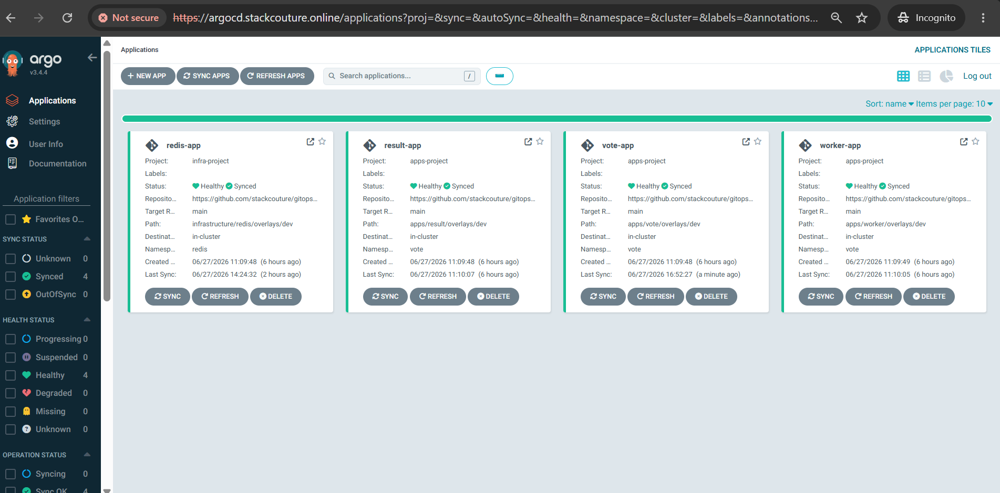
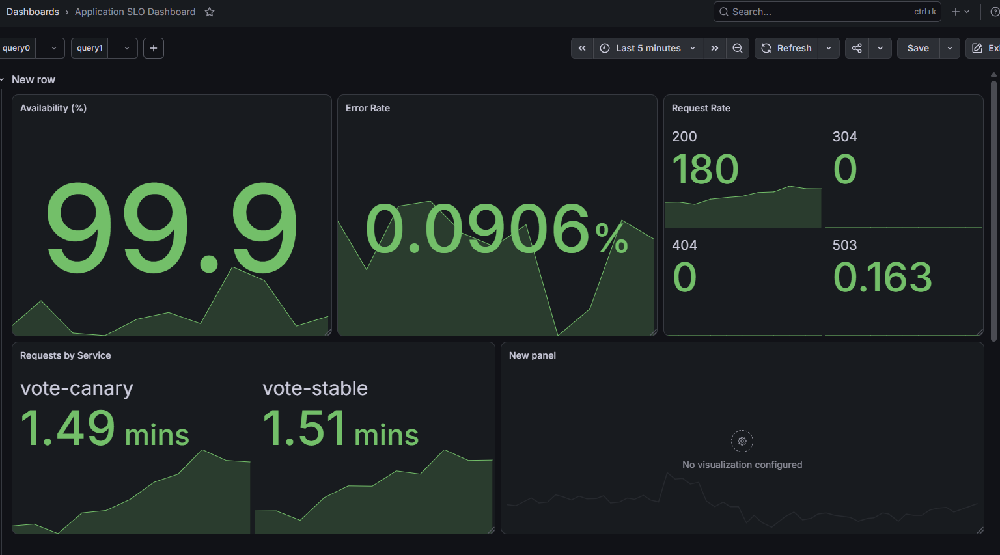
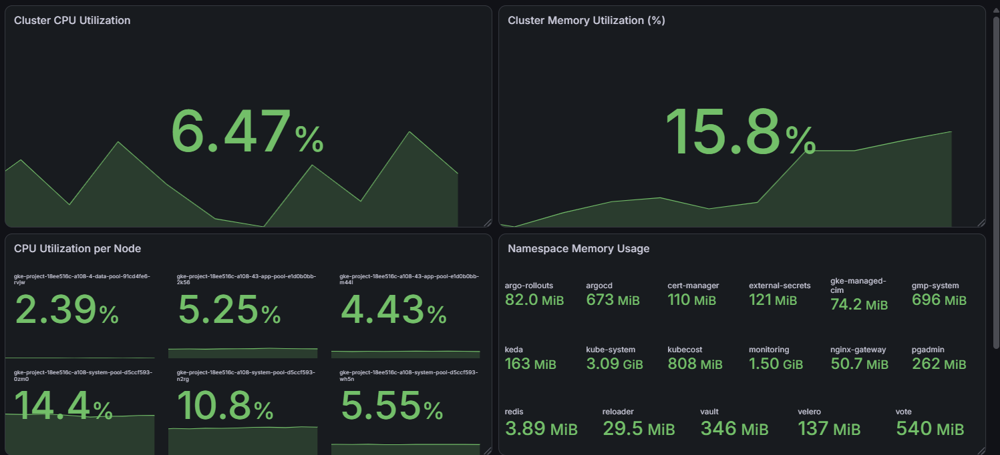
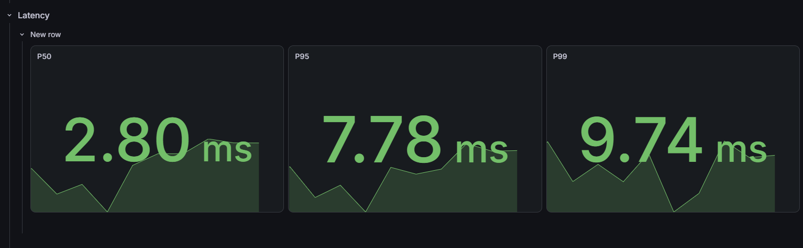

### Production-Inspired Cloud-Native Platform on Google Kubernetes Engine (GKE)

A production-inspired Kubernetes platform demonstrating Infrastructure as Code, GitOps, DevSecOps, Progressive Delivery, Observability, Runtime Security, and Automated Platform Operations.

<!--  -->

---
## 📖 Project Overview

This repository demonstrates how a modern cloud-native platform can be built
using production-inspired platform engineering practices on Google Kubernetes
Engine (GKE).

The project provisions infrastructure using Terraform, deploys applications
through GitOps with Argo CD, secures workloads using Kyverno and External
Secrets, implements Progressive Delivery with Argo Rollouts, monitors the
platform using Prometheus and Grafana, and automates operational tasks such as
autoscaling, certificate management, and cost visibility.

Rather than focusing on deploying a single application, this project showcases
the end-to-end lifecycle of designing, deploying, securing, observing, and
operating a Kubernetes platform.

---
## 📑 Table of Contents

- [📖 Project Overview](#-project-overview)
- [🏗️ Solution Architecture](#️-solution-architecture)
- [🛠️ Technology Stack](#️-technology-stack)
- [📂 Repository Structure](#-repository-structure)
- [📚 Documentation](#-documentation)
- [🚀 Platform Capabilities](#-platform-capabilities)
- [✨ Platform Features](#-platform-features)
- [📸 Demo Screenshots](#-demo-screenshots)
  - [🏗️ Platform Architecture](#️-platform-architecture)
  - [🚀 GitOps with Argo CD](#-gitops-with-argo-cd)
  - [🚀 Argo Rollouts Strategy](#-argo-rollouts-strategy)
  - [📊 Observability](#-observability)
- [📊 Project at a Glance](#-project-at-a-glance)
- [🎓 Learning Outcomes](#-learning-outcomes)
- [🔧 Troubleshooting Experience](#-troubleshooting-experience)
- [🎯 Key Takeaways](#-key-takeaways)
- [🙏 Acknowledgements](#acknowledgements)

---
## 🏗️ Solution Architecture

The following architecture illustrates the complete platform deployment on GCP.


---
## 🛠️ Technology Stack

<p align="left">


</p>

| Category | Technologies |
|----------|--------------|
| ☁️ Cloud | Google Cloud Platform (GCP) |
| 🏗️ Infrastructure as Code | Terraform |
| ☸️ Kubernetes | Google Kubernetes Engine (GKE) |
| 🚀 GitOps | Argo CD, Kustomize |
| ⚙️ CI/CD | GitHub Actions |
| 📦 Progressive Delivery | Argo Rollouts |
| 🔐 Security | Kyverno, Falco, External Secrets, Vault |
| 🌐 Networking | Gateway API, NGINX Gateway Fabric, cert-manager |
| 📊 Observability | Prometheus, Grafana, Alertmanager |
| 📈 Autoscaling | HPA, KEDA |
| 💰 Cost Management | Kubecost |
| 💾 Backup & Recovery | Velero |

---
## 📂 Repository Structure

The Platform Engineering Portfolio follows a multi-repository architecture that separates infrastructure provisioning, GitOps configuration, application source code, and platform automation into independent repositories.

```text
Platform Engineering Portfolio
│
├── platform-infra/                    # Infrastructure as Code
│   ├── terraform/
│   │   ├── environments/
│   │   └── modules/
│   └── .github/workflows/
│
├── gitops-microservices-platform/     # GitOps & Kubernetes Platform
│   ├── apps/
│   ├── infrastructure/
│   ├── platform/
│   ├── security/
│   ├── governance/
│   ├── automation/
│   └── argocd/
│
├── voting-app/                        # Application Source Code
│   ├── vote/
│   ├── result/
│   ├── worker/
│   └── .github/workflows/
│
└── platform-automation/               # Day-2 Platform Operations
    ├── automation/
    ├── reports/
    └── scripts/
```

### Repository Responsibilities

| Repository | Responsibility |
|------------|----------------|
| 🏗️ **[platform-infra](https://github.com/stackcouture/platform-infra)** | Provisions Google Cloud infrastructure and shared Kubernetes platform services using reusable Terraform modules, including GKE, networking, IAM, Cloud SQL, Artifact Registry, and platform components. |
| 🚀 **[gitops-microservices-platform](https://github.com/stackcouture/gitops-microservices-platform)** | Serves as the GitOps source of truth by managing Kubernetes manifests, Kustomize overlays, Argo CD ApplicationSets, platform services, infrastructure workloads, security policies, governance resources, and environment-specific configurations. |
| 🗳️ **[voting-app](https://github.com/stackcouture/voting-app)** | Contains the Vote, Result, and Worker microservices, Dockerfiles, automated testing, GitHub Actions CI pipelines, container image creation, security scanning, and Artifact Registry publishing. |
| 🤖 **[platform-automation](https://github.com/stackcouture/platform-automation)** | Provides Python-based automation for day-2 platform operations, including platform health validation, operational reporting, scheduled maintenance, diagnostics, and infrastructure validation. |

---
## 📚 Documentation

Explore the platform through the following documentation.

| Document                                                   | Description                                                                                                                           |
| ---------------------------------------------------------- | ------------------------------------------------------------------------------------------------------------------------------------- |
| 📘 [PROJECT_OVERVIEW.md](docs/PROJECT_OVERVIEW.md)         | Complete overview of the platform, goals, repository organization, and key capabilities.                                              |
| 📂 [REPOSITORY_STRUCTURE.md](docs/REPOSITORY_STRUCTURE.md) | Multi-repository architecture, repository organization, responsibilities, relationships, layered architecture, and design principles. |
| 🏗️ [ARCHITECTURE.md](docs/ARCHITECTURE.md)                | Platform architecture, design principles, and component interactions.                                                                 |
| ☸️ [KUBERNETES.md](docs/KUBERNETES.md)                     | Kubernetes cluster design, namespaces, workloads, scheduling, storage, and platform services.                                         |
| ☁️ [INFRASTRUCTURE.md](docs/INFRASTRUCTURE.md)             | Terraform modules, environment layout, GKE provisioning, networking, IAM, and cloud resources.                                        |
| 🚀 [GITOPS.md](docs/GITOPS.md)                             | GitOps workflow, Argo CD, ApplicationSets, Kustomize, and deployment strategy.                                                        |
| ⚙️ [CICD.md](docs/CICD.md)                                 | GitHub Actions workflows, container builds, security scanning, SBOM generation, image signing, and deployment automation.             |
| 🔒 [SECURITY.md](docs/SECURITY.md)                         | Platform security, Kyverno policies, Falco runtime security, External Secrets, RBAC, and certificate management.                      |
| 🌐 [NETWORKING.md](docs/NETWORKING.md)                     | Gateway API, ingress, TLS automation, DNS, and traffic management.                                                                    |
| 📊 [OBSERVABILITY.md](docs/OBSERVABILITY.md)               | Monitoring, logging, metrics, dashboards, alerting, and operational visibility.                                                       |
| 📈 [AUTOSCALING.md](docs/AUTOSCALING.md)                   | Horizontal Pod Autoscaler (HPA), KEDA, Cluster Autoscaler, and scaling strategies.                                                    |
| 🏛️ [DECISIONS.md](docs/DECISIONS.md)                      | Architecture Decision Records (ADRs), design trade-offs, and technology choices.                                                      |


---
## 🚀 Platform Capabilities

| Area | Technologies |
|------|--------------|
| ☁️ Infrastructure | Terraform, Google Cloud Platform (GCP) |
| ☸️ Kubernetes | Google Kubernetes Engine (GKE), Kubernetes |
| 🔄 GitOps | Argo CD, ApplicationSets, Kustomize |
| ⚙️ Continuous Integration | GitHub Actions |
| 🚀 Progressive Delivery | Argo Rollouts |
| 🔒 Security | Kyverno, Falco, RBAC |
| 🔑 Secrets Management | External Secrets Operator, Google Secret Manager, Vault |
| 🌐 Networking | Gateway API, NGINX Gateway Fabric, cert-manager |
| 📊 Observability | Prometheus, Grafana, Alertmanager |
| 📈 Autoscaling | Horizontal Pod Autoscaler (HPA), KEDA, Cluster Autoscaler |
| 💾 Data Platform | PostgreSQL, Redis |
| 💰 Cost Optimization | Kubecost |
| 🤖 Platform Automation | Python Automation, Kubernetes CronJobs |

---
## ✨ Platform Features

| Feature | Description |
|---------|-------------|
| 🚀 Infrastructure as Code | Provisions Google Cloud infrastructure using reusable Terraform modules |
| ☸️ Private GKE Cluster | Deploys workloads on a private Google Kubernetes Engine cluster |
| 🔄 GitOps Deployment | Uses Argo CD to continuously synchronize Kubernetes resources from Git |
| ⚙️ CI Pipeline | Automates build, test, vulnerability scanning, image signing, and image publishing with GitHub Actions |
| 📦 Multi-Environment Support | Manages development and production environments using Kustomize overlays |
| 🔐 Workload Identity | Provides secure authentication between Kubernetes workloads and Google Cloud services |
| 🔑 External Secret Management | Synchronizes secrets from Google Secret Manager and HashiCorp Vault using External Secrets Operator |
| 🛡️ Policy Enforcement | Enforces Kubernetes security policies using Kyverno |
| 🦅 Runtime Threat Detection | Detects suspicious runtime activity using Falco |
| 📈 Progressive Delivery | Supports Canary and Blue-Green deployments with Argo Rollouts |
| 🌐 Modern Networking | Uses Gateway API and NGINX Gateway Fabric for HTTP routing and traffic management |
| 🔒 Automatic TLS | Provisions and renews TLS certificates automatically using cert-manager and Let's Encrypt |
| 📊 Centralized Observability | Monitors applications and infrastructure with Prometheus, Grafana, and Alertmanager |
| 📉 Event-Driven Autoscaling | Scales worker pods dynamically using KEDA based on Redis queue length |
| 📈 Horizontal Autoscaling | Scales application pods automatically using Horizontal Pod Autoscaler (HPA) |
| ☁️ Cluster Autoscaling | Automatically adjusts GKE node capacity based on workload demand |
| 💰 Cost Monitoring | Tracks Kubernetes resource utilization and costs with Kubecost |
| 🗄️ Database Monitoring | Monitors PostgreSQL and Redis using Prometheus exporters |
| 📚 Architecture Documentation | Includes comprehensive documentation covering architecture, infrastructure, GitOps, networking, security, observability, autoscaling, and architectural decisions |

---
## 📸 Demo Screenshots

### 🏗️ Platform Architecture

<p align="left">
  
</p>

---
### 🚀 GitOps with Argo CD
<b> ArgoCD Output</b>
<p align="left">
  
</p>

<b>Vote ArgoCD</b>
<p align="left">
  
</p>
<b>Worker ArgoCD</b>
<p align="left">
  
</p>
<b>Result ArgoCD</b>
<p align="left">
  
</p>

---
### 🚀 Argo Rollouts Strategy
<b>Blue-Green Deployment</b>
<p align="left">
  
</p>
<b>Canary Deployment</b>
<p align="left">
  
</p>

---
### 📊 Observability
<b>Appplication SLO Voting</b>
<p align="left">
  
</p>
<b>Cluster CPU-memory Utilization</b>
<p align="left">
  
</p>
<b>Application Latency</b>
<p align="left">
  
</p>

---
## 📊 Project at a Glance

### Platform Overview

| Category                        | Details                                 |
| ------------------------------- | --------------------------------------- |
| ☁️ **Cloud Platform**           | Google Cloud Platform (GCP)             |
| ☸️ **Container Platform**       | Google Kubernetes Engine (GKE)          |
| 🏗️ **Infrastructure**          | Terraform                               |
| 🚀 **Continuous Delivery**      | GitOps with Argo CD                     |
| ⚙️ **Continuous Integration**   | GitHub Actions                          |
| 📦 **Application Architecture** | Polyglot Microservices                  |
| 🌐 **Networking**               | Gateway API & NGINX Gateway Fabric      |
| 🔐 **Security**                 | Kyverno, Falco, External Secrets, Vault |
| 📊 **Observability**            | Prometheus, Grafana, Alertmanager       |
| 📈 **Autoscaling**              | HPA & KEDA                              |
| 💰 **Cost Management**          | Kubecost                                |
| 💾 **Backup & Recovery**        | Velero                                  |

---

### Portfolio Metrics

| Metric                          |                             Value |
| ------------------------------- | --------------------------------: |
| 📁 Repositories                 |                             **4** |
| 🏗️ Infrastructure Modules      |                           **20+** |
| ☸️ Kubernetes Platform Services |                            **15** |
| 🐳 Microservices                |                             **3** |
| 🌍 Deployment Environments      |                             **2** |
| 🔄 GitOps Repositories          |                             **1** |
| ⚙️ CI Pipelines                 |                **GitHub Actions** |
| 🚀 Deployment Strategy          | **GitOps + Progressive Delivery** |

---

### Platform Features

| Area                   | Technologies                        |
| ---------------------- | ----------------------------------- |
| Infrastructure as Code | ✅ Terraform                         |
| Kubernetes Platform    | ✅ Google Kubernetes Engine          |
| GitOps                 | ✅ Argo CD                           |
| Progressive Delivery   | ✅ Argo Rollouts                     |
| Security               | ✅ Kyverno, Falco                    |
| Secret Management      | ✅ External Secrets, Vault           |
| Networking             | ✅ Gateway API, NGINX Gateway Fabric |
| Observability          | ✅ Prometheus, Grafana, Alertmanager |
| Autoscaling            | ✅ HPA, KEDA                         |
| Cost Monitoring        | ✅ Kubecost                          |
| Backup & Recovery      | ✅ Velero                            |
| CI/CD                  | ✅ GitHub Actions                    |

---

### Engineering Focus

* ✅ Production-inspired Platform Engineering
* ✅ Modular multi-repository architecture
* ✅ Infrastructure as Code (Terraform)
* ✅ GitOps-driven Kubernetes deployments
* ✅ Kubernetes security and policy enforcement
* ✅ Progressive application delivery
* ✅ Automated CI/CD pipelines
* ✅ Platform observability and alerting
* ✅ Day-2 platform automation


---
## 🎓 Learning Outcomes

Building this Platform Engineering Portfolio provided hands-on experience across the complete cloud-native application lifecycle, from infrastructure provisioning to day-2 platform operations. The project demonstrates practical knowledge in the following areas:

* Designed and provisioned production-inspired cloud infrastructure using **Terraform** on **Google Cloud Platform (GCP)**.
* Built and managed a **Google Kubernetes Engine (GKE)** cluster with dedicated node pools, namespaces, and workload scheduling.
* Implemented **GitOps** workflows using **Argo CD** and **Kustomize** to manage Kubernetes resources declaratively.
* Developed reusable **Terraform modules** and environment-specific configurations to support consistent infrastructure deployments.
* Built automated **CI pipelines** with **GitHub Actions** for application build, testing, containerization, security scanning, and image publishing.
* Implemented **progressive delivery** strategies using **Argo Rollouts** for controlled application deployments.
* Secured the Kubernetes platform using **Kyverno**, **Falco**, **RBAC**, **External Secrets Operator**, and **HashiCorp Vault**.
* Implemented secure secret management by integrating Kubernetes workloads with external secret providers.
* Configured **Gateway API**, **NGINX Gateway Fabric**, automated TLS, and DNS-based traffic management for application exposure.
* Built a comprehensive **observability platform** using **Prometheus**, **Grafana**, and **Alertmanager** for monitoring, visualization, and alerting.
* Implemented workload autoscaling using **Horizontal Pod Autoscaler (HPA)** and **KEDA** for event-driven scaling.
* Enabled cost visibility and backup capabilities using **Kubecost** and **Velero**.
* Applied a **multi-repository architecture** to separate infrastructure, GitOps configuration, application source code, and operational automation.
* Developed **Python-based automation** for platform health validation, operational reporting, and day-2 maintenance tasks.
* Gained practical experience designing, deploying, securing, monitoring, and operating a production-inspired Kubernetes platform using modern Platform Engineering practices.

These learning outcomes reflect practical, hands-on experience in designing and operating a cloud-native platform using Infrastructure as Code, GitOps, Kubernetes, CI/CD automation, security, observability, and operational best practices.

---
## 🔧 Troubleshooting Experience

Throughout the development of this Platform Engineering Portfolio, I investigated, diagnosed, and resolved a variety of real-world infrastructure, Kubernetes, GitOps, and cloud-native operational challenges. These experiences strengthened my understanding of production troubleshooting and platform operations.

### Infrastructure & Cloud

* Terraform provisioning failures and state management
* Google Cloud quota limitations and resource allocation
* IAM roles, permissions, and Workload Identity configuration
* Google Cloud authentication and service account issues
* Artifact Registry authentication and image access

### Kubernetes Platform

* Pod scheduling and resource allocation
* Node pool design and workload placement
* Node taints, tolerations, and affinity configuration
* Namespace isolation and resource management
* Persistent storage provisioning and StorageClass configuration
* Stateful workload deployment and troubleshooting

### GitOps & Deployment

* Argo CD synchronization and reconciliation issues
* Kustomize overlay configuration
* Progressive delivery using Argo Rollouts
* Helm chart installation and upgrade failures
* Kubernetes manifest validation and debugging

### Networking & Security

* Gateway API and NGINX Gateway Fabric configuration
* Ingress and service routing
* DNS configuration and resolution
* TLS certificate issuance and automated renewal with cert-manager
* External Secrets synchronization with Google Secret Manager
* RBAC configuration and access control
* Kubernetes Network Policies

### Observability & Operations

* Prometheus metrics collection and ServiceMonitor configuration
* Grafana dashboard creation and visualization
* Alertmanager configuration and alert routing
* Log analysis and platform diagnostics
* Platform health validation and operational troubleshooting

These troubleshooting scenarios provided practical experience in identifying root causes, interpreting logs and metrics, validating Kubernetes resources, and implementing reliable solutions across infrastructure, platform services, application deployments, and day-2 operations.

---
## 🎯 Key Takeaways

This project demonstrates the ability to design, build, and operate a production-inspired cloud-native platform using modern Platform Engineering practices. Throughout its implementation, the following key capabilities were developed and reinforced:

* Designed and provisioned scalable cloud infrastructure using **Terraform** on **Google Cloud Platform (GCP)**.
* Built and managed a secure **Google Kubernetes Engine (GKE)** platform with dedicated workloads, networking, and storage.
* Implemented **GitOps** workflows with **Argo CD** to enable declarative, automated, and auditable Kubernetes deployments.
* Developed reusable infrastructure and Kubernetes configurations using **Terraform modules** and **Kustomize overlays**.
* Built secure **CI/CD pipelines** with automated testing, container image creation, security scanning, SBOM generation, and deployment automation.
* Applied **Platform Engineering** principles by separating infrastructure, platform services, application source code, and operational automation into dedicated repositories.
* Strengthened platform security through policy enforcement, secret management, runtime security, and identity-based access control.
* Implemented comprehensive observability, autoscaling, backup, and cost monitoring to improve platform reliability and operational visibility.
* Gained practical experience troubleshooting infrastructure, Kubernetes, networking, GitOps, and cloud-native operational challenges.
* Integrated infrastructure provisioning, application delivery, security, observability, and automation into a cohesive, production-inspired Platform Engineering platform.

This portfolio reflects practical, hands-on experience with the technologies, workflows, and operational practices commonly used to build and manage modern Kubernetes-based platforms in production environments.


---
## Acknowledgements

The sample application used in this portfolio is based on Docker's Example Voting App.

- Original project: https://github.com/dockersamples/example-voting-app
- Original authors: Docker, Inc.
- License: Apache License 2.0

This repository extends the original sample by implementing a production-oriented Platform Engineering solution on Google Cloud Platform, including Infrastructure as Code (Terraform), GitOps with Argo CD, CI/CD with GitHub Actions, Kubernetes platform services, security, observability, progressive delivery, backup and disaster recovery, cost optimization, and platform automation.

---