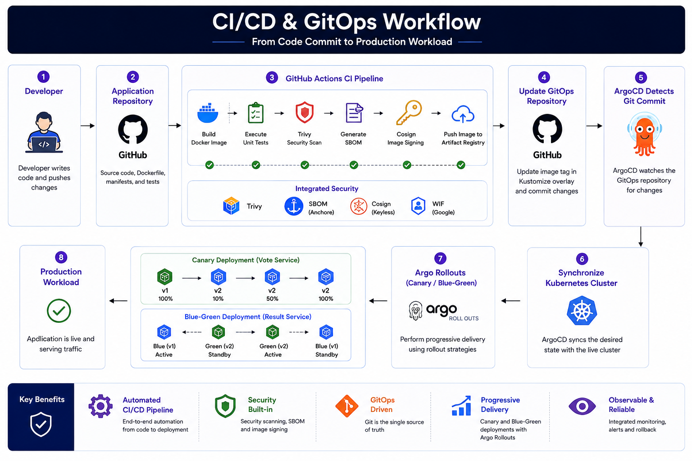

## 🚀 Production-Inspired Cloud-Native Platform on Google Kubernetes Engine (GKE)

A production-inspired Kubernetes platform demonstrating Infrastructure as Code, GitOps, DevSecOps, Progressive Delivery, Observability, Runtime Security, and Automated Platform Operations.

<!--  -->

---
## Solution Architecture

The following architecture illustrates the complete platform deployment on GCP.


---
## 📑 Table of Contents

- [🏗️ Solution Architecture](#solution-architecture)
- [🏛️ Platform Layers](#platform-layers)
  - [🏗️ Infrastructure Layer](#1-infrastructure-layer)
  - [⚙️ Platform Layer](#2-platform-layer)
  - [🔄 GitOps Layer](#3-gitops-layer)
  - [🗳️ Application Layer](#4-application-layer)
  - [🚀 CI/CD Layer](#5-cicd-layer)
  - [🛡️ Security Layer](#6-security-layer)
  - [📊 Observability Layer](#7-observability-layer)
  - [🤖 Platform Automation Layer](#8-platform-automation-layer)
- [🛠️ Technology Stack](#technology-stack)
- [⭐ Key Capabilities](#key-capabilities)
- [📂 Repository Structure](#repository-structure)
- [📖 Repository Overview](#repository-overview)
- [📌 Layer Responsibilities](#layer-responsibilities)
- [🔗 How It Fits Together](#how-it-fits-together)
- [🚀 Infrastructure Provisioning](#infrastructure-provisioning)
- [🚀 CI/CD Pipeline](#cicd-pipeline)
- [🔄 GitOps Workflow](#gitops-workflow)
- [🛡️ Security & Compliance](#security--compliance)
- [📈 Observability & Monitoring](#observability--monitoring)
- [🚦 Progressive Delivery](#progressive-delivery)
- [💾 Disaster Recovery](#disaster-recovery)
- [💰 Cost Optimization](#cost-optimization)
- [🤖 Platform Automation](#platform-automation)
- [🎥 Project Walkthrough](#project-walkthrough)
- [🔮 Future Enhancements](#future-enhancements)
- [📚 Learning Outcomes](#learning-outcomes)
- [🙏 Acknowledgements](#acknowledgements)

---
### Project Repositories

## 📂 Project Repositories

| Repository | Purpose | Link |
|------------|---------|------|
| 🏗️ Infrastructure | Terraform modules provisioning the complete GCP platform | https://github.com/stackcouture/platform-infra |
| 🚀 GitOps | ArgoCD applications, ApplicationSets, Kustomize overlays and platform manifests | https://github.com/stackcouture/gitops-microservices-platform |
| 🗳️ Voting Application | Vote, Worker and Result microservices with Kubernetes manifests | https://github.com/stackcouture/voting-app |
| 🤖 Platform Automation | Kubernetes CronJobs, Slack notifications, backup automation and operational scripts | https://github.com/stackcouture/platform-automation |

---
## Platform Layers

### 1. Infrastructure Layer

The **Infrastructure Layer** is fully provisioned using **Terraform**, providing the cloud foundation required to operate the platform.

It provisions:

- VPC 
- Cloud Router and Cloud NAT for controlled outbound access
- Firewall rules
- IAM roles and Workload Identity Federation
- Google Kubernetes Engine (GKE)
- Cloud SQL (PostgreSQL)
- Artifact Registry
- Cloud Storage
- Service Accounts

Infrastructure is organized into reusable Terraform modules, enabling consistent deployments across **Development** and **Production** environments by reusing the same modules with environment-specific variables.

---

### 2. Platform Layer

After the Kubernetes cluster is provisioned, the **Platform Layer** installs the shared services required by application teams.

Platform components include:

- ArgoCD
- Argo Rollouts
- Gateway API
- NGINX Gateway Fabric
- Cert-Manager
- External Secrets Operator
- Kyverno
- Falco
- Prometheus
- Grafana
- Alertmanager
- Kubecost
- KEDA
- Velero
- Reloader

These services transform a standard Kubernetes cluster into a production-ready Internal Developer Platform (IDP).

---

### 3. GitOps Layer

Application delivery follows a **GitOps** workflow where all deployment changes are managed through Git. Direct deployments to the Kubernetes cluster are not permitted.

**ArgoCD** continuously reconciles the desired state stored in Git with the live cluster state.

#### GitOps Capabilities

- Declarative, version-controlled deployments
- Automatic synchronization and drift detection
- One-command rollback
- Environment promotion using Kustomize overlays

---

### 4. Application Layer

The platform hosts a cloud-native microservices application consisting of:

- Vote Service
- Result Service
- Worker Service
- PostgreSQL
- Redis

Application manifests are managed using **Kustomize**, with separate overlays for each environment.

Progressive delivery is implemented using **Argo Rollouts**, supporting:

- Canary Deployments
- Blue-Green Deployments

---

### 5. CI/CD Layer

Continuous Integration is implemented using **GitHub Actions**.

The pipeline performs:

1. Source code checkout
2. Dependency installation
3. Docker image build
4. Trivy vulnerability scanning
5. SBOM generation
6. Cosign image signing
7. Push image to Artifact Registry
8. Update GitOps manifests automatically

Once the GitOps repository is updated, **ArgoCD** automatically synchronizes the cluster with the latest application version.

---

### 6. Security Layer

Security is integrated throughout the platform using a DevSecOps approach.

Key security capabilities include:

- Kyverno policy enforcement
- Pod Security Standards (PSS)
- Kubernetes Network Policies
- Role-Based Access Control (RBAC)
- External Secrets Operator
- Workload Identity Federation
- Trivy image vulnerability scanning
- Software Bill of Materials (SBOM)
- Cosign container image signing
- Falco runtime threat detection

These controls ensure workloads comply with organizational security policies before reaching production.

---

### 7. Observability Layer

Platform observability is powered by:

- Prometheus
- Grafana
- Alertmanager

Monitoring includes:

- Kubernetes cluster metrics
- Application metrics
- Redis exporter metrics
- PostgreSQL exporter metrics
- ServiceMonitors
- Alerting rules
- Grafana dashboards

This provides comprehensive visibility into platform health, application performance, and infrastructure utilization.

---

### 8. Platform Automation Layer

Operational tasks are automated using Python-based services.

Automation includes:

- Daily platform health reports

These automation services reduce manual effort, improve platform reliability, and streamline day-to-day operations.

Architectural principles

- Infrastructure as Code (Terraform)
- GitOps-driven continuous delivery
- Immutable infrastructure
- Declarative Kubernetes configuration
- Platform self-service
- Security by default & policy as code
- Progressive delivery
- Infrastructure reusability across environments
- Production-grade observability
- Automated platform operations
---

## Technology Stack

| Category | Technologies |
|----------|--------------|
| **Cloud Platform** | Google Cloud Platform (GCP), Virtual Private Cloud (VPC), Cloud Router, Cloud NAT, Cloud Storage, Cloud SQL (PostgreSQL), Artifact Registry |
| **Infrastructure as Code** | Terraform |
| **Container Platform** | Docker, Google Kubernetes Engine (GKE) |
| **GitOps & Continuous Delivery** | ArgoCD, Argo Rollouts, Kustomize |
| **CI/CD** | GitHub Actions |
| **Traffic Management** | Gateway API, NGINX Gateway Fabric |
| **Security** | Kyverno, Falco, Workload Identity Federation, Kubernetes RBAC, Pod Security Standards (PSS), External Secrets Operator, Cosign, Trivy, SBOM |
| **Secrets & Certificates** | Vault, External Secrets Operator, Google Secret Manager, Cert-Manager, Let's Encrypt |
| **Observability** | Prometheus, Grafana, Alertmanager |
| **Autoscaling** | KEDA, Horizontal Pod Autoscaler (HPA), Cluster Autoscaler |
| **Cost Management** | Kubecost |
| **Backup & Disaster Recovery** | Velero |
| **Configuration Management** | Reloader |
| **Databases & Messaging** | PostgreSQL (Cloud SQL), Redis |
| **Programming Languages** | Python, YAML, Bash |
| **Version Control** | Git, GitHub |
---

## Key Capabilities

- **Infrastructure as Code (IaC)** – Provision and manage cloud infrastructure using reusable Terraform modules with environment-specific configurations.

- **Production-Ready Kubernetes Platform** – Deploy a secure and scalable Google Kubernetes Engine (GKE) platform with shared services and standardized operational practices.

- **GitOps-Based Continuous Delivery** – Enable declarative, version-controlled deployments with ArgoCD, automated synchronization, drift detection, and environment promotion through Kustomize overlays.

- **Automated CI/CD Pipelines** – Build, test, scan, sign, and publish container images using GitHub Actions, integrating security checks into every deployment.

- **Progressive Delivery** – Perform Canary and Blue-Green deployments with Argo Rollouts to reduce deployment risk and support safe application releases.

- **Policy-Driven Security** – Enforce Kubernetes best practices using Kyverno, Pod Security Standards (PSS), RBAC, Workload Identity Federation, and runtime security with Falco.

- **Supply Chain Security** – Integrate vulnerability scanning with Trivy, generate Software Bill of Materials (SBOM), and sign container images using Cosign to strengthen software supply chain integrity.

- **Secrets & Certificate Management** – Securely manage application secrets with External Secrets Operator, vault and Google Secret Manager, while automating TLS certificate issuance and renewal with Cert-Manager.

- **Traffic Management & Networking** – Implement modern Kubernetes networking using Gateway API and NGINX Gateway Fabric for secure and flexible traffic routing.

- **Observability & Alerting** – Monitor platform and application health with Prometheus, Grafana, Alertmanager, and exporter-based metrics for proactive issue detection.

- **Event-Driven Autoscaling** – Dynamically scale workloads using KEDA, Horizontal Pod Autoscaler (HPA), and Cluster Autoscaler to optimize resource utilization.

- **Cost Visibility & Optimization** – Monitor Kubernetes resource consumption and optimize cloud spending with Kubecost.

- **Backup & Disaster Recovery** – Protect workloads and persistent data using Velero to support backup, restore, and disaster recovery operations.

- **Platform Automation** – Automate operational tasks such as cluster health validation, infrastructure reporting, and routine maintenance through Python-based automation services.

- **Modular & Reusable Architecture** – Organize infrastructure, platform components, and application deployments into reusable modules and repositories, enabling consistency across multiple environments.

---
## Repository Structure
A production-grade **Platform Engineering Portfolio** demonstrating Infrastructure as Code, GitOps, Kubernetes Platform Engineering, Security, Observability, Progressive Delivery, and CI/CD automation on Google Cloud Platform.

```text
Platform Engineering Portfolio
│
├── platform-infra/                    # Infrastructure as Code (Terraform)
│   │
│   ├── .github/
│   │   ├── actions/
│   │   │   └── gcp-auth/
│   │   └── workflows/
│   │
│   └── terraform/
│       ├── environments/
│       │   ├── dev/
│       │   │   ├── networking/
│       │   │   ├── iam/
│       │   │   ├── gke/
│       │   │   ├── cloud-sql/
│       │   │   ├── storage/
│       │   │   │   ├── artifact-registry/
│       │   │   │   └── cloud-storage/
│       │   │   └── platform/
│       │   │       ├── argocd/
│       │   │       ├── argo-rollouts/
│       │   │       ├── cert-manager/
│       │   │       ├── external-secrets/
│       │   │       ├── falco/
│       │   │       ├── ingress/
│       │   │       ├── keda/
│       │   │       ├── kubecost/
│       │   │       ├── kyverno/
│       │   │       ├── monitoring/
│       │   │       ├── nginx-gateway/
│       │   │       ├── reloader/
│       │   │       ├── storage-classes/
│       │   │       ├── vault/
│       │   │       └── velero/
│       │   │
│       │   └── prod/
│       │
│       └── modules/
│           ├── networking/
│           ├── iam/
│           ├── gke/
│           ├── cloud-sql/
│           ├── storage/
│           │   ├── artifact-registry/
│           │   └── cloud-storage/
│           └── platform/
│               ├── argocd/
│               ├── argo-rollouts/
│               ├── cert-manager/
│               ├── external-secrets/
│               ├── falco/
│               ├── ingress/
│               ├── istio/
│               ├── keda/
│               ├── kubecost/
│               ├── kyverno/
│               ├── monitoring/
│               ├── nginx-gateway/
│               ├── reloader/
│               ├── storage-classes/
│               ├── vault/
│               └── velero/
│
├── gitops-microservices-platform/     # GitOps Repository
│   │
│   ├── apps/
│   │   ├── vote/
│   │   │   ├── base/
│   │   │   └── overlays/
│   │   │       ├── dev/
│   │   │       └── prod/
│   │   │
│   │   ├── result/
│   │   │   ├── base/
│   │   │   └── overlays/
│   │   │       ├── dev/
│   │   │       └── prod/
│   │   │
│   │   └── worker/
│   │       ├── base/
│   │       └── overlays/
│   │           ├── dev/
│   │           └── prod/
│   │
│   ├── infrastructure/
│   │   ├── postgres/
│   │   ├── redis/
│   │   ├── pgadmin/
│   │   └── external-secrets-sa/
│   │
│   ├── platform/
│   │   ├── namespaces/
│   │   ├── gateway-api/
│   │   ├── ingress/
│   │   ├── clusterissuer/
│   │   ├── cluster-secrets/
│   │   ├── monitoring/
│   │   │   ├── postgres-exporter/
│   │   │   └── redis-exporter/
│   │   └── velero/
│   │
│   ├── security/
│   │   ├── kyverno/
│   │   ├── falco/
│   │   └── network-policies/
│   │
│   ├── governance/
│   │   ├── argocd/
│   │   ├── cert-manager/
│   │   ├── monitoring/
│   │   ├── postgres/
│   │   ├── redis/
│   │   └── vote/
│   │
│   ├── automation/
│   │   ├── common/
│   │   └── daily-platform-report/
│   │
│   └── argocd/
│       ├── applicationsets/
│       └── projects/
│
├── voting-app/                        # Application Source Code
│   ├── vote/
│   ├── result/
│   ├── worker/
│   └── .github/
│       └── workflows/
│
└── platform-automation/               # Platform Automation
    └── daily-platform-report/
```

| Repository | Description |
|------------|-------------|
| **platform-infra** | Infrastructure as Code (Terraform) repository that provisions Google Cloud infrastructure (VPC, GKE, Cloud SQL, IAM, Storage) and installs platform components such as ArgoCD, Kyverno, Prometheus, KEDA, Cert-Manager, External Secrets, Falco, Kubecost, and Velero. |
| **gitops-microservices-platform** | GitOps repository containing Kubernetes manifests, Kustomize overlays, ArgoCD ApplicationSets, platform services, security policies, governance, and application deployments for different environments. |
| **voting-app** | Microservices application source code consisting of Vote, Result, and Worker services, along with CI pipelines for building, testing, scanning, and publishing container images. |
| **platform-automation** | Platform automation repository containing Python-based automation tools, scheduled jobs, operational reports, health checks, and day-to-day platform maintenance scripts. |

---
## Repository Overview

The platform is organized into multiple repositories, following a modular architecture that separates infrastructure, platform services, application source code, and GitOps configuration. This approach improves maintainability, enables independent versioning, and aligns with production Platform Engineering practices.

| Repository | Purpose |
|------------|---------|
| **platform-infra** | Provisions Google Cloud infrastructure and Kubernetes platform services using Terraform. |
| **gitops-microservices-platform** | Stores Kubernetes manifests, Kustomize overlays, and ArgoCD Applications that define the desired cluster state. |
| **voting-app** | Contains the application source code, Dockerfiles, unit tests, and GitHub Actions CI pipelines for the Vote, Result, and Worker services. |
| **platform-automation** | Contains Python-based automation services for platform health validation, operational reporting, and scheduled maintenance tasks. |

---
### Repository Responsibilities

#### platform-infra

Responsible for provisioning and managing the platform infrastructure, including:

- Google Cloud infrastructure
- Networking
- Google Kubernetes Engine (GKE)
- Cloud SQL
- Artifact Registry
- IAM and Workload Identity Federation
- Kubernetes platform services
- Terraform modules

---

#### gitops-microservices-platform

Acts as the GitOps repository and contains:

- Kubernetes manifests
- Kustomize base and overlays
- ArgoCD Applications
- Argo Rollouts
- Gateway API resources
- Environment-specific configurations

---

#### voting-app

Contains the application implementation, including:

- Vote Service
- Result Service
- Worker Service
- Dockerfiles
- GitHub Actions CI pipelines

---

#### platform-automation

Provides operational automation, including:

- Cluster health validation
- Platform health reporting
- Infrastructure validation
- Scheduled maintenance
- Operational reporting

### Repository Relationships

```text
                Developer
                     │
                     ▼
          voting-app Repository
                     │
         GitHub Actions CI Pipeline
                     │
                     ▼
         Google Artifact Registry
                     │
                     ▼
  gitops-microservices-platform
                     │
              ArgoCD GitOps
                     │
                     ▼
          Google Kubernetes Engine
                     ▲
                     │
         platform-infra Repository
     (Terraform Infrastructure & Platform)
                     │
                     ▼
        platform-automation Repository
     (Health Checks & Operational Tasks)
```

### Benefits of the Multi-Repository Approach

- Clear separation of responsibilities
- Independent development and versioning
- Improved maintainability
- GitOps-driven deployments
- Reusable infrastructure modules
- Simplified collaboration
- Better security and access control
- Production-ready repository organization

---
## Layer Responsibilities

| Layer | Purpose | Core Components |
|-------|---------|-----------------|
| **Infrastructure** | Establishes the cloud foundation, including networking, compute, storage, identity, and managed services. | Terraform, VPC, GKE, Cloud SQL, Artifact Registry, IAM, Workload Identity Federation |
| **Platform** | Provides shared Kubernetes services that enable secure, reliable, and scalable application delivery. | ArgoCD, Argo Rollouts, Gateway API, NGINX Gateway Fabric, Cert-Manager, External Secrets Operator, Kyverno, Falco, Prometheus, Grafana, Alertmanager, Kubecost, KEDA, Velero, Reloader |
| **Application** | Hosts the cloud-native business workloads running on the platform. | Vote Service, Result Service, Worker Service, PostgreSQL, Redis |

---
## How It Fits Together

The platform follows a layered architecture where each layer has a clearly defined responsibility and lifecycle.

### Infrastructure Layer

The infrastructure is provisioned using reusable **Terraform modules** and serves as the foundation of the platform. It creates and manages the networking, Kubernetes cluster, managed database, container registry, and cloud identity resources. The same Terraform modules are reused across **Development** and **Production** environments, with environment-specific configuration provided through variables.

### Platform Layer

After the infrastructure is available, the platform layer installs the shared Kubernetes services required by all workloads. These services provide continuous delivery, traffic management, security policy enforcement, runtime protection, monitoring, autoscaling, cost visibility, backup, and operational automation. Since these components are shared, they operate independently of any individual application.

### Application Layer

Applications are deployed using a **GitOps** workflow rather than manual deployment. All application manifests are version-controlled in Git, and **ArgoCD** continuously reconciles the desired state with the live Kubernetes cluster. This approach eliminates manual deployment steps and ensures deployments are repeatable, auditable, and consistent across environments.

### Separation of Responsibilities

Each layer is independently managed and can evolve without impacting the others. Infrastructure changes are isolated from platform services, while platform upgrades can be performed without modifying application code. This separation of concerns improves maintainability, scalability, and long-term platform evolution.

---
## Infrastructure Provisioning

The entire platform is provisioned using **Terraform**, providing a fully automated, repeatable, and production-ready deployment process. The infrastructure is organized into reusable modules and deployed consistently across environments using environment-specific variables.

Infrastructure provisioning includes both **Google Cloud resources** and the **Kubernetes platform services** required to operate the cluster.

### Google Cloud Infrastructure

Terraform provisions the following cloud resources:

- Virtual Private Cloud (VPC)
- Private Subnets
- Cloud Router
- Cloud NAT
- Firewall Rules
- Google Kubernetes Engine (GKE)
- Cloud SQL (PostgreSQL)
- Artifact Registry
- Cloud Storage
- IAM Roles and Service Accounts
- Workload Identity Federation

### Kubernetes Platform Components

After the GKE cluster is provisioned, Terraform automatically installs the shared platform services using the **Helm** and **Kubernetes** providers.

Platform services include:

- ArgoCD
- Argo Rollouts
- Cert-Manager
- External Secrets Operator
- NGINX Gateway Fabric
- Gateway API
- Kyverno
- Falco
- Prometheus
- Grafana
- Alertmanager
- Kubecost
- KEDA
- Reloader
- Velero
- Storage Classes
- Vault

### Infrastructure Deployment Workflow

Terraform executes the infrastructure deployment in a layered approach:

1. Provision Google Cloud infrastructure.
2. Create the GKE cluster and node pools.
3. Configure IAM and Workload Identity Federation.
4. Install Kubernetes platform components using Helm.
5. Configure storage classes, ingress, certificates, secrets, monitoring, security policies, and backup services.
6. Prepare the platform for GitOps-based application deployment with ArgoCD.

### Key Characteristics

- Fully automated infrastructure provisioning
- Modular Terraform architecture
- Environment-specific deployments
- Idempotent infrastructure changes
- Version-controlled Infrastructure as Code (IaC)
- Automated platform bootstrapping
- Production-ready Kubernetes foundation
---
## CI/CD Pipeline

The platform implements a fully automated CI/CD pipeline using **GitHub Actions**. Every change to the application source code is validated, secured, packaged, and promoted through a GitOps workflow before being deployed to the Kubernetes cluster.

### Pipeline Workflow

```text
Developer Push
      │
      ▼
GitHub Actions
      │
      ├── Checkout Source Code
      ├── Build Docker Image
      ├── Trivy Vulnerability Scan
      ├── Generate SBOM
      ├── Push Image to Artifact Registry
      ├── Sign Image with Cosign
      ├── Attest SBOM
      └── Update GitOps Repository
                │
                ▼
           ArgoCD Detects Change
                │
                ▼
      Synchronize Kubernetes Cluster
                │
                ▼
      Progressive Deployment using
           Argo Rollouts
```

### Pipeline Stages

| Stage | Description |
|--------|-------------|
| **Source Checkout** | Retrieves the latest application source code from GitHub. |
| **Container Build** | Builds a Docker container image for the application. |
| **Security Scanning** | Performs container vulnerability scanning using Trivy. |
| **SBOM Generation** | Generates a Software Bill of Materials (SBOM) in SPDX format. |
| **Container Registry** | Pushes the validated container image to Google Artifact Registry. |
| **Image Signing** | Cryptographically signs container images using Cosign keyless signing. |
| **SBOM Attestation** | Attaches the generated SBOM as an image attestation. |
| **GitOps Update** | Updates the image tag in the GitOps repository using Kustomize. |
| **Continuous Deployment** | ArgoCD automatically synchronizes the Kubernetes cluster with the updated GitOps manifests. |
| **Progressive Delivery** | Argo Rollouts performs Canary or Blue-Green deployments with automated rollout strategies. |

### Security Controls

The CI/CD pipeline integrates security throughout the software delivery lifecycle.

- Automated unit testing
- Container image vulnerability scanning with Trivy
- Software Bill of Materials (SBOM) generation
- Keyless container image signing using Cosign
- SBOM attestation
- Secure authentication to Google Cloud using Workload Identity Federation
- GitOps-based deployment with no direct cluster access

### GitOps Deployment Flow

1. A developer pushes code changes to the application repository.
2. GitHub Actions executes the CI pipeline.
3. A new container image is built and validated.
4. The image is pushed to Google Artifact Registry.
5. The image is signed and an SBOM attestation is generated.
6. The GitOps repository is automatically updated with the new image tag.
7. ArgoCD detects the Git commit and synchronizes the Kubernetes cluster.
8. Argo Rollouts performs a controlled application deployment using the configured rollout strategy.

---
## GitOps Workflow

The platform follows a **GitOps** operating model, where Git serves as the single source of truth for application and infrastructure configuration. All deployment changes are made through version-controlled repositories, ensuring that the live Kubernetes cluster continuously matches the desired state defined in Git.

Direct deployments to the cluster are not performed. Instead, **ArgoCD** continuously monitors the GitOps repository and reconciles any detected changes automatically.

---


---
### Workflow Overview

```text
Developer
    │
    ▼
Application Repository
    │
    ▼
GitHub Actions CI
    │
    ├── Build Docker Image
    ├── Execute Unit Tests
    ├── Trivy Security Scan
    ├── Generate SBOM
    ├── Cosign Image Signing
    └── Push Image to Artifact Registry
                │
                ▼
Update GitOps Repository
(Kustomize Image Tag)
                │
                ▼
ArgoCD Detects Git Commit
                │
                ▼
Synchronize Kubernetes Cluster
                │
                ▼
Argo Rollouts
(Canary / Blue-Green Deployment)
                │
                ▼
Production Workload
```

### Workflow Steps

1. A developer commits and pushes code changes to the application repository.
2. GitHub Actions validates the application by running automated tests.
3. A new container image is built and scanned for vulnerabilities using Trivy.
4. A Software Bill of Materials (SBOM) is generated, and the container image is signed using Cosign.
5. The validated image is pushed to Google Artifact Registry.
6. The CI pipeline updates the image tag in the GitOps repository using Kustomize.
7. ArgoCD detects the Git commit and synchronizes the Kubernetes cluster with the desired state.
8. Argo Rollouts performs a progressive deployment using the configured rollout strategy.
9. The application becomes available after the rollout completes successfully.

### GitOps Benefits

- Git as the single source of truth
- Declarative, version-controlled deployments
- Automated synchronization and drift detection
- Immutable deployment history
- Consistent deployments across environments
- Simplified rollback using Git history
- Progressive delivery with Argo Rollouts
- Fully automated deployment pipeline with no manual `kubectl apply`

### Repository Responsibilities

| Repository | Responsibility |
|------------|----------------|
| **Application Repository** | Stores application source code, Dockerfiles, tests, and GitHub Actions workflows. |
| **GitOps Repository** | Stores Kubernetes manifests, Kustomize overlays, ArgoCD Applications, and deployment configuration. |
| **Infrastructure Repository** | Stores Terraform modules for provisioning cloud infrastructure and platform components. |

---
## Security & Compliance

Security is embedded throughout the platform following **DevSecOps** principles. Security controls are integrated into the infrastructure, CI/CD pipeline, Kubernetes platform, and runtime environment to protect workloads, enforce organizational policies, and strengthen the software supply chain.

### Security Controls

| Category | Technologies | Purpose |
|----------|--------------|---------|
| **Identity & Access Management** | IAM, Workload Identity Federation, Kubernetes RBAC | Secure authentication and least-privilege access to cloud and Kubernetes resources. |
| **Policy Enforcement** | Kyverno | Enforce Kubernetes security policies, resource standards, and deployment best practices. |
| **Secrets Management** | External Secrets Operator, Google Secret Manager, Vault | Securely manage application secrets without storing sensitive information in Git repositories. |
| **Container Security** | Trivy | Scan container images for vulnerabilities before deployment. |
| **Software Supply Chain** | SBOM, Cosign | Generate Software Bill of Materials (SBOM) and cryptographically sign container images to verify authenticity and integrity. |
| **Runtime Security** | Falco | Monitor Kubernetes workloads for suspicious or unauthorized runtime activity. |
| **Network Security** | Private VPC, Firewall Rules, Gateway API, Network Policies | Protect workloads using controlled network access and secure traffic routing. |
| **Transport Security** | Cert-Manager, Let's Encrypt | Automate TLS certificate provisioning and renewal for encrypted communication. |

### Security Practices

The platform implements the following security best practices:

- Infrastructure as Code with version-controlled Terraform modules
- Least-privilege access using IAM and Kubernetes RBAC
- Workload Identity Federation for secure authentication without long-lived service account keys
- Policy-as-Code enforcement using Kyverno
- Container image vulnerability scanning during CI
- Software Bill of Materials (SBOM) generation for supply chain transparency
- Keyless container image signing using Cosign
- Runtime threat detection with Falco
- Centralized secrets management using External Secrets Operator
- Automated TLS certificate lifecycle management
- Private networking for critical cloud resources
- GitOps-based deployments with a fully auditable change history

### Compliance Alignment

The platform incorporates security controls commonly associated with modern cloud security and compliance frameworks, including:

- Least Privilege Access
- Defense in Depth
- Zero Trust Principles
- Infrastructure as Code (IaC)
- Policy as Code
- GitOps
- Secure Software Supply Chain
- Continuous Vulnerability Management
- Encryption in Transit
- Auditability and Change Tracking

> **Note:** This project demonstrates security practices aligned with industry standards and production-grade platform engineering. It is intended as a technical implementation and is not presented as a certified or audited compliance environment.

---
## Observability & Monitoring

The platform provides centralized observability through a comprehensive monitoring stack that collects metrics, visualizes system health, and delivers proactive alerting across infrastructure and application workloads.

Monitoring components are deployed as shared platform services, enabling consistent visibility into Kubernetes resources, application performance, and platform operations.

### Observability Stack

| Component | Purpose |
|-----------|---------|
| **Prometheus** | Collects and stores metrics from Kubernetes, applications, and platform services. |
| **Grafana** | Visualizes metrics through interactive dashboards for infrastructure and application monitoring. |
| **Alertmanager** | Processes Prometheus alerts and routes notifications based on configured alerting rules. |
| **ServiceMonitors** | Automatically discovers and scrapes metrics from Kubernetes workloads. |
| **Redis Exporter** | Exposes Redis performance and health metrics to Prometheus. |
| **PostgreSQL Exporter** | Exposes PostgreSQL database metrics for monitoring and capacity planning. |

### Monitoring Coverage

The platform continuously monitors:

- Kubernetes cluster health
- Node resource utilization
- Pod health and availability
- Application performance metrics
- HTTP request rates and response times
- CPU and memory utilization
- Persistent storage usage
- PostgreSQL performance metrics
- Redis performance metrics
- Kubernetes workload status
- Platform service availability

### Alerting Capabilities

Prometheus and Alertmanager provide proactive alerting for operational events, including:

- Pod failures and restarts
- High CPU utilization
- High memory utilization
- Application availability issues
- Database connectivity failures
- Storage capacity thresholds
- Kubernetes node health
- Service endpoint availability

### Key Capabilities

- Centralized metrics collection
- Real-time infrastructure monitoring
- Application performance monitoring
- Database and cache monitoring
- Interactive Grafana dashboards
- Automated alert generation
- Service discovery using ServiceMonitors
- Historical metrics for troubleshooting and capacity planning
- Scalable monitoring architecture for Kubernetes workloads

### Design Principles

The observability platform is designed to provide:

- **Visibility** – Comprehensive insights into infrastructure and application health.
- **Reliability** – Early detection of operational issues through automated alerting.
- **Scalability** – Automatic monitoring of newly deployed workloads.
- **Operational Efficiency** – Centralized dashboards and metrics simplify troubleshooting and performance analysis.

---
## Progressive Delivery

The platform implements **Progressive Delivery** using **Argo Rollouts**, enabling application updates to be released gradually with minimal risk. Instead of replacing all application instances at once, new versions are introduced in controlled stages, allowing validation before full production rollout.

Progressive delivery is fully integrated with the GitOps workflow, ensuring deployments remain declarative, automated, and version-controlled.

### Deployment Strategies

| Strategy | Purpose |
|----------|---------|
| **Canary Deployment** | Gradually shifts production traffic to a new application version while monitoring application health and performance. |
| **Blue-Green Deployment** | Deploys a new application version alongside the existing version and switches traffic only after successful validation. |

### Deployment Workflow

```text
Developer Push
        │
        ▼
GitHub Actions CI Pipeline
        │
        ▼
Container Image Published
        │
        ▼
GitOps Repository Updated
        │
        ▼
ArgoCD Synchronization
        │
        ▼
Argo Rollouts
        │
        ├── Deploy New Version
        ├── Shift Traffic Gradually
        ├── Validate Rollout
        └── Promote or Roll Back
        │
        ▼
Production Workload
```

### Rollout Capabilities

- Canary deployments with incremental traffic shifting
- Blue-Green deployments for zero-downtime releases
- Automated rollout progression
- Controlled production releases
- Rapid rollback to the previous stable version
- Integration with GitOps workflows
- Version-controlled deployment configuration
- Declarative rollout definitions using Kubernetes custom resources

### Benefits

- Minimized deployment risk
- Reduced application downtime
- Safer production releases
- Faster recovery from failed deployments
- Improved deployment confidence
- Consistent and repeatable release process
- Fully automated deployment lifecycle

---
## Disaster Recovery

The platform includes **backup and disaster recovery** capabilities using **Velero**, enabling Kubernetes resources and persistent data to be backed up and restored when required. This helps protect critical workloads from accidental deletion, infrastructure failures, and operational errors.

### Backup Components

| Component | Purpose |
|-----------|---------|
| **Velero** | Backs up and restores Kubernetes resources and persistent volumes. |
| **Cloud Storage** | Stores backup archives in a durable and scalable object storage bucket. |
| **Persistent Volumes** | Preserves application data for stateful workloads such as PostgreSQL and Redis. |

### Backup Scope

The backup solution protects:

- Kubernetes resources
- Namespaces
- Deployments
- Services
- ConfigMaps
- Secrets
- Persistent Volume Claims (PVCs)
- PostgreSQL data
- Redis data
- Platform configuration

### Recovery Workflow

```text
Platform Failure
        │
        ▼
Identify Recovery Point
        │
        ▼
Retrieve Backup
        │
        ▼
Restore Kubernetes Resources
        │
        ▼
Restore Persistent Data
        │
        ▼
Validate Platform Health
        │
        ▼
Resume Application Services
```
---
### Recovery Capabilities
- Scheduled platform backups
- On-demand backup creation
- Kubernetes resource restoration
- Persistent volume recovery
- Namespace-level recovery
- Application-level recovery
- Disaster recovery testing
- Version-controlled infrastructure reconstruction using Terraform

---
### Design Principles

The disaster recovery strategy is based on:

- **Automation** – Backup and restore operations are managed through Velero.
- **Reliability** – Platform resources and persistent data can be recovered from backup.
- **Repeatability** – Infrastructure can be recreated using Terraform, while Kubernetes workloads are restored using GitOps and Velero.
- **Resilience** – Stateless workloads are redeployed automatically, while stateful workloads are recovered from persistent backups.

---
## Cost Optimization

The platform incorporates cost optimization practices to improve resource efficiency while maintaining application performance and availability. By combining Kubernetes autoscaling, resource governance, and cost visibility, the platform helps reduce unnecessary cloud resource consumption.

---
### Cost Optimization Components

| Component | Purpose |
|-----------|---------|
| **Kubecost** | Provides visibility into Kubernetes resource utilization and estimated infrastructure costs. |
| **KEDA** | Scales workloads based on application demand and external events, reducing idle resource consumption. |
| **Horizontal Pod Autoscaler (HPA)** | Automatically adjusts the number of application replicas based on resource utilization. |
| **Cluster Autoscaler** | Dynamically scales Kubernetes node pools to match workload demand. |
| **Resource Requests & Limits** | Ensures efficient CPU and memory allocation while preventing resource contention. |

---
### Cost Optimization Strategies

The platform implements the following optimization techniques:

- Dynamic application scaling using KEDA
- Automatic pod scaling with Horizontal Pod Autoscaler (HPA)
- Automatic node scaling using Cluster Autoscaler
- Resource requests and limits for efficient scheduling
- Dedicated node pools for system, application, and data workloads
- Continuous cost monitoring with Kubecost
- Capacity planning using Prometheus and Grafana metrics
- Efficient scheduling of workloads based on resource requirements

---
### Cost Visibility

Kubecost provides insights into:

- CPU utilization
- Memory utilization
- Namespace-level resource consumption
- Workload-level resource consumption
- Estimated Kubernetes infrastructure costs
- Resource allocation trends
- Cost optimization opportunities

---
### Key Benefits

- Improved resource utilization
- Reduced over-provisioning
- Automatic scaling based on demand
- Better infrastructure capacity planning
- Increased workload efficiency
- Enhanced visibility into Kubernetes resource usage
- Data-driven cost optimization decisions

---
### Design Principles

The platform follows these cost optimization principles:

- **Right-Sizing** – Allocate appropriate CPU and memory resources to workloads.
- **Elasticity** – Scale applications and infrastructure based on real-time demand.
- **Visibility** – Monitor resource consumption and identify optimization opportunities.
- **Efficiency** – Maximize utilization while maintaining application performance and reliability.

---
## Platform Automation

The platform includes Python-based automation services that streamline routine operational tasks, reduce manual intervention, and improve platform reliability. These automation workflows support day-to-day platform operations by validating cluster health, generating operational reports, and executing scheduled maintenance activities.

Automation services are designed to integrate with the Kubernetes platform and cloud infrastructure, enabling consistent and repeatable operational processes.

---
### Automation Capabilities

| Automation Service | Purpose |
|--------------------|---------|
| **Cluster Health Validation** | Verifies the health of Kubernetes clusters, nodes, and workloads. |

---
### Automation Workflow

```text
Scheduled Trigger
        │
        ▼
Python Automation Service
        │
        ├── Validate Cluster Health
        ├── Check Platform Services
        ├── Verify Infrastructure Status
        ├── Collect Metrics
        ├── Generate Reports
        └── Publish Results
```
---
### Key Capabilities

- Automated platform health validation
- Kubernetes cluster status verification
- Infrastructure health checks
- Scheduled operational tasks
- Automated reporting
- Consistent operational workflows
- Reduced manual intervention
- Improved operational efficiency

---
### Design Principles

The platform automation services are designed around the following principles:

- **Automation First** – Routine operational activities are automated wherever practical.
- **Reliability** – Continuous validation helps detect issues before they impact workloads.
- **Consistency** – Standardized automation ensures repeatable operational processes.
- **Scalability** – Automation services can be extended to support additional operational use cases as the platform evolves.

---
## Project Walkthrough


This walkthrough demonstrates the complete lifecycle of the platform, from infrastructure provisioning to application deployment, monitoring, security, and operations.

### 1. Provision Infrastructure

Deploy the cloud infrastructure using Terraform.

**Demonstrates:**

- Virtual Private Cloud (VPC)
- Google Kubernetes Engine (GKE)
- Cloud SQL (PostgreSQL)
- Artifact Registry
- IAM and Workload Identity Federation
- Terraform modular architecture

---

### 2. Bootstrap the Kubernetes Platform

Install the shared Kubernetes platform services.

**Demonstrates:**

- ArgoCD
- Argo Rollouts
- Gateway API
- NGINX Gateway Fabric
- Cert-Manager
- External Secrets Operator
- Kyverno
- Falco
- Prometheus
- Grafana
- Alertmanager
- Kubecost
- KEDA
- Velero
- Reloader

---

### 3. Deploy the Application

Deploy the Vote, Result, and Worker services using GitOps.

**Demonstrates:**

- GitOps workflow
- Kustomize overlays
- ArgoCD synchronization
- Environment-specific deployments

---

### 4. Execute the CI/CD Pipeline

Commit a change to the application repository and observe the automated pipeline.

**Pipeline Stages:**

- Source code checkout
- Dependency installation
- Unit testing
- Docker image build
- Trivy vulnerability scan
- SBOM generation
- Cosign image signing
- Push image to Artifact Registry
- Automatic GitOps repository update

---

### 5. Observe Progressive Delivery

Watch Argo Rollouts deploy the new application version.

**Demonstrates:**

- Canary deployment
- Blue-Green deployment
- Progressive traffic shifting
- Automated rollout promotion
- Rollback capabilities

---

### 6. Explore Security Controls

Review the platform's built-in security features.

**Demonstrates:**

- Kyverno policy enforcement
- Workload Identity Federation
- Kubernetes RBAC
- External Secrets integration
- Container image signing
- Vulnerability scanning
- Runtime security with Falco

---

### 7. Monitor the Platform

Access the monitoring dashboards.

**Demonstrates:**

- Prometheus metrics
- Grafana dashboards
- Alertmanager alerts
- PostgreSQL exporter
- Redis exporter
- Application health metrics

---

### 8. Review Cost Optimization

Inspect Kubernetes resource utilization and cost insights.

**Demonstrates:**

- Kubecost dashboards
- Namespace cost allocation
- Resource utilization
- Capacity planning
- Optimization recommendations

---

### 9. Verify Autoscaling

Generate application load and observe automatic scaling.

**Demonstrates:**

- KEDA event-driven autoscaling
- Horizontal Pod Autoscaler (HPA)
- Cluster Autoscaler
- Dynamic workload scaling

---

### 10. Backup and Restore

Demonstrate platform resilience using Velero.

**Demonstrates:**

- Backup creation
- Resource restoration
- Persistent volume recovery
- Disaster recovery workflow

---

### 11. Platform Automation

Run the platform automation services.

**Demonstrates:**

- Cluster health validation
- Infrastructure verification
- Platform health reporting
- Scheduled operational tasks

---

## Expected Outcome

By the end of this walkthrough, the platform demonstrates:

- Automated infrastructure provisioning
- Production-ready Kubernetes platform
- GitOps-based application delivery
- Progressive deployment strategies
- Integrated DevSecOps practices
- Centralized observability
- Event-driven autoscaling
- Cost visibility and optimization
- Backup and disaster recovery
- Python-based operational automation

---
## Future Enhancements

The platform is designed with a modular architecture, allowing new capabilities to be integrated as operational and business requirements evolve. Planned enhancements include:

### Platform

- Multi-cluster Kubernetes management
- Multi-region deployment for high availability
- Private GKE clusters with enhanced network isolation
- Cluster fleet management and centralized governance

### GitOps & Delivery

- Automated promotion between Development, Staging, and Production environments
- Progressive delivery with automated metric-based analysis
- Preview environments for pull requests
- Automated rollback based on deployment health

### Security

- Policy validation within CI pipelines
- Container image admission verification
- Secret rotation automation
- Enhanced software supply chain security and artifact verification

### Observability

- Centralized log aggregation
- Distributed tracing for microservices
- Service Level Objectives (SLOs) and Service Level Indicators (SLIs)
- Enhanced operational dashboards and reporting

### Platform Automation

- Automated Terraform drift detection
- Platform compliance reporting
- Certificate expiration monitoring
- Backup verification and recovery validation
- Automated platform health assessments and notifications

### Reliability

- Automated disaster recovery testing
- Scheduled backup validation
- High-availability database architecture
- Chaos engineering for resilience testing

### Developer Experience

- Self-service application onboarding
- Standardized application templates
- Internal developer portal
- Automated environment provisioning

### Cost Optimization

- Intelligent resource right-sizing recommendations
- Automated idle resource cleanup
- Budget monitoring and cost alerts
- Enhanced capacity planning and forecasting
---

## Learning Outcomes

Over the past months, I designed, deployed, troubleshot, and operated a production-style Platform Engineering environment on **Google Cloud Platform (GCP)**. This project provided hands-on experience across the complete software delivery lifecycle—from infrastructure provisioning to Kubernetes operations, GitOps, security, observability, and automation.

---

## Skills Gained

| Area                             | Learning Outcomes                                                                                                                                                                 |
| -------------------------------- | --------------------------------------------------------------------------------------------------------------------------------------------------------------------------------- |
| **Infrastructure & Cloud**       | Designed modular Terraform infrastructure, managed remote state, configured VPC networking, Cloud NAT, IAM, Workload Identity Federation, and resolved cloud provisioning issues. |
| **Platform Engineering**         | Built a production-ready Kubernetes platform integrating GitOps, observability, security, autoscaling, backup, and shared platform services.                                      |
| **GitOps & Continuous Delivery** | Implemented GitOps with ArgoCD and Kustomize, configured Argo Rollouts, and learned declarative deployment and reconciliation workflows.                                          |
| **CI/CD & DevSecOps**            | Developed GitHub Actions pipelines for automated testing, container builds, vulnerability scanning, SBOM generation, image signing, and GitOps updates.                           |
| **Security**                     | Implemented Policy as Code, RBAC, Workload Identity Federation, External Secrets, runtime security, and secure software supply chain practices.                                   |
| **Observability**                | Built centralized monitoring using Prometheus, Grafana, Alertmanager, ServiceMonitors, and database exporters for operational visibility.                                         |
| **Reliability**                  | Implemented backup and recovery, autoscaling, cost optimization, and operational best practices for production environments.                                                      |

---

## Troubleshooting Experience

Throughout the project, I investigated and resolved real-world engineering challenges, including:

* Terraform provisioning failures
* Google Cloud quota limitations
* IAM permission and authentication issues
* Kubernetes scheduling and resource allocation problems
* Node pools, taints, tolerations, and affinity configuration
* Helm deployment failures
* DNS, Gateway API, and ingress configuration
* TLS certificate issuance and renewal
* External Secrets synchronization
* Persistent storage provisioning
* Container registry authentication
* GitOps synchronization and reconciliation
* Progressive deployment configuration
* Monitoring and alerting configuration
* Kubernetes networking and traffic routing

---

## Technical Expertise Developed

### Infrastructure as Code

* Modular Terraform architecture
* Remote state management
* Environment-specific deployments
* Infrastructure automation

### Kubernetes Platform Engineering

* Google Kubernetes Engine (GKE)
* Platform bootstrapping
* Shared platform services
* Production-grade cluster operations

### GitOps

* ArgoCD
* Kustomize
* Argo Rollouts
* Declarative deployments

### CI/CD

* GitHub Actions
* Docker
* Artifact Registry
* Automated deployment pipelines

### DevSecOps

* Trivy
* Cosign
* SBOM
* Kyverno
* Falco
* External Secrets
* Workload Identity Federation

### Observability

* Prometheus
* Grafana
* Alertmanager
* PostgreSQL Exporter
* Redis Exporter

### Reliability

* Velero
* KEDA
* Horizontal Pod Autoscaler (HPA)
* Cluster Autoscaler
* Kubecost

---

## Key Takeaways

Through this project, I strengthened my ability to:

* Build production-grade cloud infrastructure using Infrastructure as Code.
* Design and operate Kubernetes platforms following Platform Engineering principles.
* Implement GitOps-based application delivery using ArgoCD.
* Build secure CI/CD pipelines with integrated DevSecOps practices.
* Apply observability, automation, and reliability best practices.
* Troubleshoot complex cloud-native infrastructure systematically.
* Integrate infrastructure, Kubernetes, GitOps, CI/CD, security, and observability into a cohesive Platform Engineering platform.

---
## Acknowledgements

The sample application used in this portfolio is based on Docker's Example Voting App.

- Original project: https://github.com/dockersamples/example-voting-app
- Original authors: Docker, Inc.
- License: Apache License 2.0

This repository extends the original sample by implementing a production-oriented Platform Engineering solution on Google Cloud Platform, including Infrastructure as Code (Terraform), GitOps with Argo CD, CI/CD with GitHub Actions, Kubernetes platform services, security, observability, progressive delivery, backup and disaster recovery, cost optimization, and platform automation.

---