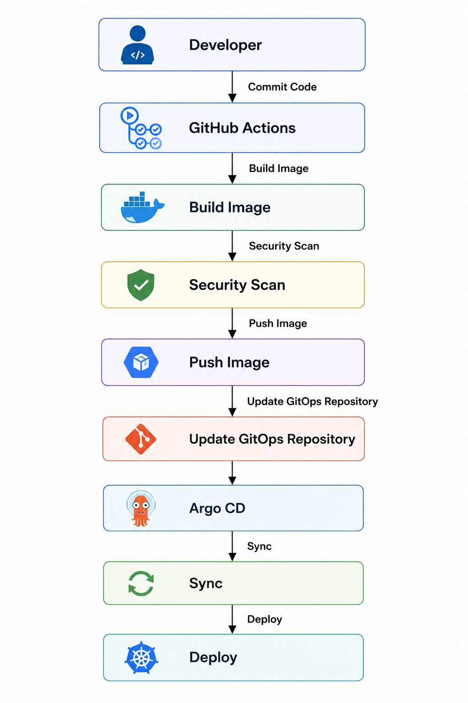

## 🏗️ Platform Architecture

### Overview

This document describes the architecture of the **Platform Engineering Portfolio**, a production-inspired Kubernetes platform built on **Google Kubernetes Engine (GKE)**. The platform demonstrates modern cloud-native practices for infrastructure provisioning, application delivery, security, observability, and operations.

The design emphasizes:

- Infrastructure as Code (IaC)
- GitOps-based Continuous Delivery
- Policy-driven security
- Progressive application delivery
- Centralized observability
- Workload isolation
- Cloud-native scalability

The objective is to provide a repeatable, secure, and maintainable platform suitable for deploying multiple applications in a Kubernetes environment.

---
## Architecture Principles

The platform is designed around the following principles.

### Infrastructure as Code

All cloud resources are provisioned using Terraform, enabling repeatable and version-controlled infrastructure deployments.

---
### GitOps

Kubernetes manifests are managed declaratively through Git repositories.

Argo CD continuously reconciles the desired state stored in Git with the actual cluster state.

---
### Security by Default

Security controls are integrated into the platform rather than added later.

Examples include:

- External Secrets Operator
- Workload Identity
- Kyverno admission policies
- Non-root containers
- TLS encryption
- Least privilege IAM

---
### Separation of Responsibilities

The platform separates infrastructure, platform services, and applications into independent layers.

This separation improves maintainability and allows teams to evolve each layer independently.

---
### Observability First

Every workload should expose metrics and be observable through centralized monitoring and alerting.

---
## Platform Layers

The platform consists of four logical layers.

<p align="center">
  
</p>


Each layer has a well-defined responsibility and communicates with adjacent layers through standard Kubernetes APIs.

---
## High-Level Architecture


---
## Platform Components

### Infrastructure Layer

Provides the cloud resources required by the platform.

Responsibilities include:

- Kubernetes cluster
- Networking
- IAM
- Artifact Registry
- Cloud Storage

---
### Platform Layer

Provides shared services used by every application.

Major components include:

| Component | Purpose |
|----------|---------|
| Argo CD | GitOps Continuous Delivery |
| External Secrets Operator | Secret synchronization |
| cert-manager | Certificate lifecycle management |
| Kyverno | Kubernetes policy enforcement |
| Gateway API | Traffic routing |
| Prometheus | Metrics collection |
| Grafana | Visualization |
| Alertmanager | Alert routing |

---
### Application Layer

Business workloads are deployed independently using GitOps.

Each application follows the same deployment model.

Typical application architecture:

```text
Frontend
     │
     ▼
Backend API
     │
     ▼
Redis
     │
     ▼
PostgreSQL
```

---
## Deployment Architecture

Application delivery follows a GitOps workflow.

<p align="center">
  
</p>

The Git repository is treated as the single source of truth for Kubernetes resources.

---
## Traffic Flow

External requests follow the path below.

<p align="center">
  
</p>


This architecture enables secure ingress, controlled traffic routing, and progressive deployments.

---
## Progressive Delivery

Application releases use Argo Rollouts instead of standard Kubernetes Deployments.

Typical rollout strategy:


Failed health checks pause or roll back the deployment before affecting all users.

---
## Security Architecture

The platform follows a layered security model.

```text
Internet
    │
Cloudflare
    │
Gateway API
    │
Kyverno Policies
    │
Namespaces
    │
RBAC
    │
Application Pods
    │
External Secrets
    │
Google Secret Manager
```

Security controls include:

- TLS encryption
- Secret externalization
- Admission policies
- Least privilege access
- Namespace isolation
- Image validation
- Resource validation

---
## Secrets Management

Application secrets are managed outside Git.

```text
Google Secret Manager
          │
          ▼
External Secrets Operator
          │
          ▼
Kubernetes Secret
          │
          ▼
Application
```

This approach eliminates hardcoded credentials from the repository.

---
## Observability Architecture

Monitoring is centralized using Prometheus and Grafana.

<p align="center">
  
</p>


The monitoring stack provides:

- Infrastructure metrics
- Kubernetes metrics
- Application metrics
- Alerting
- Dashboard visualization

---
## Workload Isolation

Dedicated node pools isolate different workload types.

| Node Pool | Purpose |
|-----------|----------|
| System | Platform services |
| Application | Business workloads |
| Data | Stateful services |

Benefits include:

- Improved scheduling
- Independent scaling
- Better resource utilization
- Operational isolation

---
## Scalability

The platform is designed to scale horizontally.

Scaling capabilities include:

- Horizontal Pod Autoscaler (HPA)
- Cluster Autoscaler
- Dedicated node pools
- Stateless application scaling

Stateful workloads are isolated to dedicated infrastructure to reduce operational impact.

---
## Design Decisions

| Decision | Rationale |
|----------|-----------|
| GitOps | Declarative deployments and automatic reconciliation |
| Argo CD | Continuous synchronization and drift detection |
| Argo Rollouts | Safer production deployments |
| Gateway API | Modern Kubernetes networking model |
| External Secrets | Secure secret management |
| Kyverno | Policy enforcement without custom admission webhooks |
| cert-manager | Automated certificate management |
| Prometheus | CNCF standard monitoring |
| Grafana | Centralized dashboards |

---
## Architecture Goals

The platform is designed to achieve the following goals:

- Automated infrastructure provisioning
- Declarative Kubernetes management
- Secure application deployment
- Reliable progressive delivery
- Centralized monitoring
- Policy-driven governance
- Operational simplicity
- Production-inspired architecture

---
## Future Enhancements

Potential improvements include:

- Multi-cluster GitOps
- Service mesh integration
- Disaster recovery automation
- Multi-region deployment
- Cost optimization dashboards
- OpenTelemetry distributed tracing

---
## Summary

This platform demonstrates a modern Platform Engineering architecture that combines Infrastructure as Code, GitOps, Kubernetes, policy-based security, and observability into a cohesive deployment model.

The architecture prioritizes automation, reliability, scalability, and operational consistency while following cloud-native best practices suitable for enterprise Kubernetes environments.

---