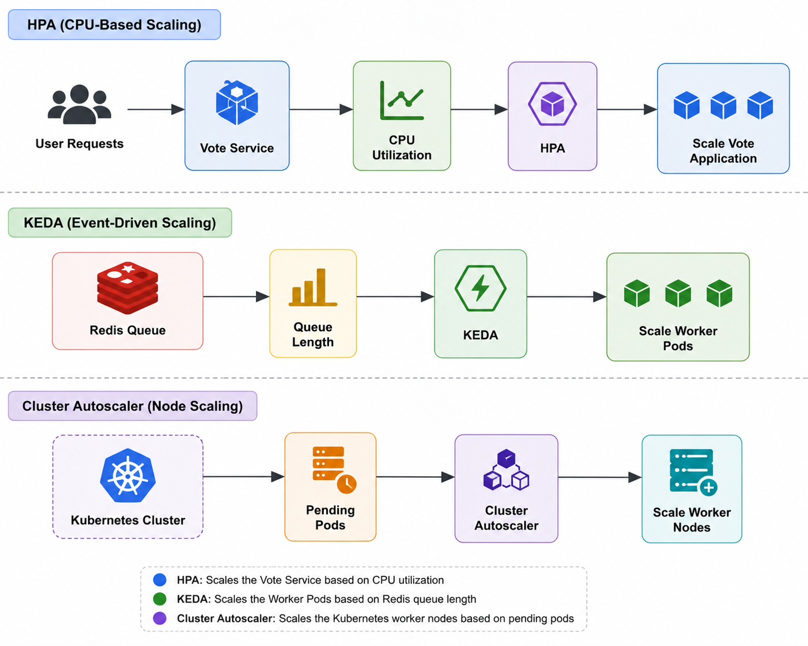

## 📈 Platform Autoscaling

### 📖 Overview

This document describes the autoscaling architecture implemented for the **Production-Inspired Platform Engineering on Google Kubernetes Engine (GKE)** project.

The platform combines multiple autoscaling mechanisms to optimize resource utilization while maintaining application performance under varying workloads.

Three complementary autoscaling capabilities are implemented:

* **Horizontal Pod Autoscaler (HPA)** for CPU-based application scaling
* **KEDA** for event-driven worker scaling based on Redis queue length
* **Cluster Autoscaler** for dynamically scaling Kubernetes worker nodes

Together, these components provide scalable and efficient resource management across the platform.

---
## 📑 Table of Contents

* 📖 Overview
* 🎯 Autoscaling Goals
* 🏗️ Autoscaling Architecture
* 📊 Horizontal Pod Autoscaler (HPA)
* ⚡ KEDA Event-Driven Autoscaling
* ☁️ Cluster Autoscaler
* 🔄 Autoscaling Workflow
* 📋 Benefits
* ⚠️ Challenges Encountered
* 🎓 Key Learnings
* 📝 Summary

---
## 🎯 Autoscaling Goals

The platform was designed to:

* Scale applications automatically
* Optimize infrastructure utilization
* Reduce manual intervention
* Support fluctuating workloads
* Improve application availability
* Scale worker services based on real workload demand

---
## 🏗️ Autoscaling Architecture

<p align="left">
  
</p>

---
## 📊 Horizontal Pod Autoscaler (HPA)

The platform uses Kubernetes **Horizontal Pod Autoscaler (HPA)** to automatically scale stateless application workloads based on CPU utilization.

The HPA continuously monitors resource usage through the Kubernetes Metrics Server.

When CPU utilization exceeds the configured threshold, additional pod replicas are created automatically.

Benefits include:

* Automatic scaling
* Reduced response time
* Better resource utilization
* Improved availability

---
## ⚡ KEDA Event-Driven Autoscaling

The Worker service processes asynchronous jobs received through a **Redis queue**.

Instead of scaling based on CPU utilization, the Worker service scales according to the number of pending messages in the Redis queue.

The platform uses **KEDA (Kubernetes Event-Driven Autoscaling)** with a **Redis trigger**.

Workflow:

```text
Application
      │
      ▼
 Redis Queue
      │
Queue Length
      │
      ▼
    KEDA
      │
      ▼
Worker Deployment
      │
      ▼
Worker Pods
```

KEDA continuously monitors the Redis queue length.

As the queue grows, additional Worker pods are created automatically.

When the queue is processed and becomes empty, Worker pods scale back down, reducing resource consumption.

This event-driven approach is well suited for background processing workloads where CPU utilization alone does not accurately represent demand.

---
### Why Redis Queue Length?

The Worker service consumes background jobs from Redis.

Using Redis queue length as the scaling metric provides several advantages:

* Directly reflects pending work
* Faster scaling decisions
* Efficient background processing
* Reduced idle resources
* Improved throughput during workload spikes

This implementation demonstrates a common production pattern for asynchronous event processing using KEDA.

---
## ☁️ Cluster Autoscaler

The platform also uses the **Cluster Autoscaler** provided by Google Kubernetes Engine.

When additional pods cannot be scheduled due to insufficient cluster capacity, the Cluster Autoscaler automatically provisions additional nodes.

When demand decreases, unused nodes are removed to optimize infrastructure costs.

This ensures that both compute resources and application replicas scale together.

---
## 🔄 Autoscaling Workflow

```text
Client Requests
       │
       ▼
Vote Service
       │
 CPU Utilization
       │
       ▼
      HPA
       │
       ▼
Additional Pods

──────────────────────────

Background Jobs
       │
       ▼
 Redis Queue
       │
       ▼
     KEDA
       │
       ▼
 Worker Pods

──────────────────────────

Pending Pods
       │
       ▼
Cluster Autoscaler
       │
       ▼
Additional Nodes
```

---
## 📋 Benefits

The autoscaling platform provides:

* Automatic workload scaling
* Event-driven scaling
* Infrastructure elasticity
* Improved resource utilization
* Reduced operational overhead
* Faster application response
* Better handling of workload spikes
* Cost-efficient resource allocation

---
## ⚠️ Challenges Encountered

During implementation, several autoscaling challenges were addressed:

* Configuring Kubernetes Metrics Server
* HPA resource tuning
* Redis trigger configuration
* KEDA ScaledObject configuration
* Worker scaling thresholds
* Node capacity planning
* Cluster Autoscaler validation

These challenges were resolved through Kubernetes metrics analysis, KEDA diagnostics, and workload testing.

---
## 🎓 Key Learnings

This implementation provided practical experience with:

* Horizontal Pod Autoscaler
* KEDA
* Redis-based event-driven scaling
* Cluster Autoscaler
* Metrics-based autoscaling
* Kubernetes resource optimization
* Capacity planning
* Production-inspired autoscaling strategies

---
## 📝 Summary

The platform combines **Horizontal Pod Autoscaler**, **KEDA**, and **Cluster Autoscaler** to deliver a comprehensive autoscaling solution. CPU-based scaling handles stateless application workloads, Redis queue length drives event-based scaling for background workers, and the Cluster Autoscaler dynamically adjusts node capacity. Together, these mechanisms provide efficient, resilient, and production-inspired autoscaling for Kubernetes workloads.

---