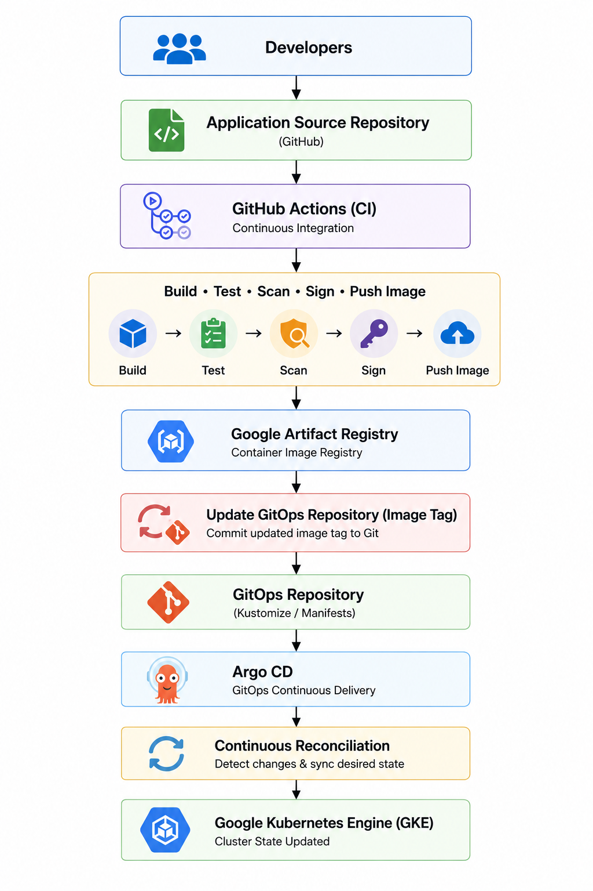

## 🚀 GitOps Architecture

### Overview

GitOps is the operational model used throughout this platform to manage Kubernetes resources declaratively. Instead of deploying workloads directly from the Continuous Integration (CI) pipeline, the desired state of the Kubernetes cluster is stored in Git and continuously reconciled by **Argo CD**.

This approach separates **Continuous Integration (CI)** from **Continuous Delivery (CD)**, improves deployment consistency, and provides an auditable, version-controlled deployment process.

---
## Why GitOps?

Traditional deployment pipelines often allow CI systems to deploy directly into Kubernetes clusters. While this approach works, it introduces challenges such as configuration drift, limited auditability, and inconsistent environments.

This platform adopts GitOps to address these challenges.

Key objectives include:

* Git as the single source of truth
* Declarative infrastructure and application deployments
* Automated reconciliation
* Drift detection
* Version-controlled deployment history
* Simplified rollback
* Repeatable deployments across environments

---
## GitOps Workflow

The deployment workflow is divided into two independent stages.

### Continuous Integration

Developers commit application code to the source repository.

The CI pipeline performs:

* Source checkout
* Dependency installation
* Unit testing
* Docker image build
* Vulnerability scanning using Trivy
* SBOM generation
* Image signing using Cosign
* Push image to Google Artifact Registry
* Update image tag in the GitOps repository

The CI pipeline **does not deploy directly to Kubernetes**.

---
### Continuous Delivery

Argo CD continuously monitors the GitOps repository.

When a change is detected:

1. Repository changes are identified.
2. Desired state is compared with the cluster.
3. Differences are calculated.
4. Resources are synchronized.
5. Kubernetes reaches the desired state.

---
## GitOps Architecture

  

Git remains the authoritative source for the desired state of the Kubernetes cluster, while Argo CD ensures that the cluster continuously matches that state.

---
## Design Principles

The GitOps implementation follows several key design principles.

### Declarative Configuration

All Kubernetes resources are defined declaratively using YAML manifests.

Examples include:

* Deployments and Rollouts
* Services
* ConfigMaps
* ServiceAccounts
* RBAC
* Gateway API resources
* Monitoring resources

The cluster state is derived entirely from Git.

---
### Separation of Responsibilities

The deployment pipeline separates CI from CD.

| Responsibility     | Tool                     |
| ------------------ | ------------------------ |
| Build & Test       | GitHub Actions           |
| Container Registry | Google Artifact Registry |
| Desired State      | Git Repository           |
| Deployment         | Argo CD                  |
| Runtime            | Google Kubernetes Engine |

This separation simplifies maintenance and reduces deployment risk.

---
### Environment Management

Environment-specific configuration is managed using **Kustomize overlays**.

A common base is shared between environments while overlays provide environment-specific customization.

Benefits include:

* Reduced duplication
* Consistent configuration
* Easier maintenance
* Scalable environment management

---
### Automated Reconciliation

Argo CD continuously compares the desired state stored in Git with the running state of the Kubernetes cluster.

If manual changes are made to the cluster, Argo CD detects the drift and restores the desired configuration automatically.

This ensures cluster consistency over time.

---
## Security

GitOps improves the overall security posture of the platform.

### Immutable Deployments

Deployments originate from version-controlled Git commits rather than manual commands.

---
### Secure Software Supply Chain

The CI pipeline integrates multiple security controls before deployment.

These include:

* Trivy vulnerability scanning
* Software Bill of Materials (SBOM)
* Cosign image signing

Only verified images are promoted through the deployment pipeline.

---
### Secret Management

Sensitive configuration is excluded from Git.

Secrets are synchronized from **Google Secret Manager** using **External Secrets Operator**, allowing applications to consume Kubernetes Secrets without exposing credentials in source control.

---
### Policy Enforcement

Platform-wide governance is enforced using Kyverno.

Policies validate Kubernetes resources before they are admitted into the cluster.

Examples include:

* Required labels
* Resource requests and limits
* Liveness and readiness probes
* Non-root containers
* Approved container registries

---
## Benefits

Adopting GitOps provides several operational advantages.

* Declarative deployments
* Consistent environments
* Automated synchronization
* Drift detection
* Version-controlled infrastructure
* Simplified rollback
* Improved auditability
* Reduced manual intervention
* Better collaboration between development and operations teams

These practices contribute to a more reliable and maintainable Kubernetes platform.

---
## Lessons Learned

Building this platform provided practical experience in implementing GitOps at scale.

Key takeaways include:

* Separating CI from CD results in a cleaner deployment architecture.
* Keeping Git as the single source of truth simplifies operational management.
* Kustomize overlays provide an effective strategy for managing multiple environments.
* Argo CD's reconciliation model eliminates configuration drift and improves consistency.
* GitOps integrates naturally with progressive delivery strategies such as Argo Rollouts.
* Combining GitOps with policy enforcement, external secret management, and observability creates a secure and production-inspired platform.

---
## Conclusion

GitOps serves as the operational foundation of this platform engineering project. By combining GitHub Actions for Continuous Integration with Argo CD for Continuous Delivery, the platform achieves automated, repeatable, and auditable Kubernetes deployments.

This architecture demonstrates how modern platform engineering teams manage cloud-native applications using Infrastructure as Code, declarative configuration, and GitOps principles while maintaining security, reliability, and operational consistency.

---
