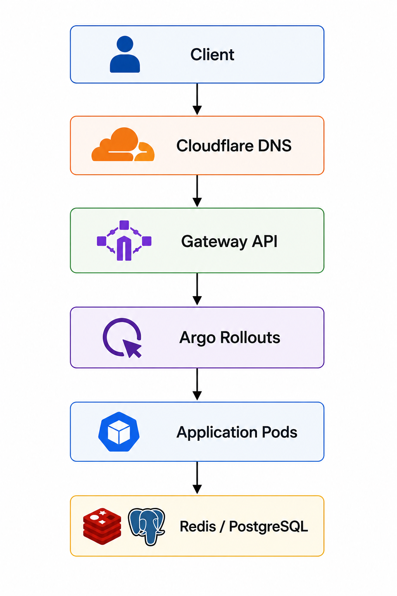

##  Networking

### Overview

This document describes the networking architecture implemented for the **Cloud-Native Engineering on Google Kubernetes Engine (GKE)** project.

The platform uses the **Kubernetes Gateway API** together with **NGINX Gateway Fabric** to provide modern traffic management, secure ingress, TLS termination, and application routing.

External traffic is protected using **Cloudflare DNS** and **TLS certificates** automatically managed by **cert-manager** with **Let's Encrypt**.

The networking architecture is designed to be secure, scalable, and cloud-native while supporting GitOps and progressive delivery.

---
## Table of Contents

- [Overview](#overview)
- [Networking Goals](#networking-goals)
- [Networking Architecture](#networking-architecture)
- [External Traffic Flow](#external-traffic-flow)
- [Gateway API](#gateway-api)
- [HTTP Routing](#http-routing)
- [TLS Management](#tls-management)
- [Cloudflare Integration](#cloudflare-integration)
- [Progressive Traffic Management](#progressive-traffic-management)
  - [Canary Deployment](#canary-deployment)
  - [Blue-Green Deployment](#blue-green-deployment)
- [Internal Service Communication](#internal-service-communication)
- [Networking Benefits](#networking-benefits)
- [Challenges Encountered](#challenges-encountered)
- [Key Learnings](#key-learnings)
- [Summary](#summary)

---
## Networking Goals

The networking layer was designed with the following objectives:

* Secure external access
* Centralized traffic management
* Automatic TLS provisioning
* Cloud-native routing
* Environment isolation
* GitOps-managed networking
* Progressive application delivery
* Simplified service exposure

---
## Networking Architecture

<p align="left">
  
</p>

The networking stack routes incoming requests from the Internet through Cloudflare and Gateway API before reaching application workloads.

---
## External Traffic Flow

Client requests follow the networking path below.

```text
Internet
     │
     ▼
Cloudflare DNS
     │
     ▼
Gateway API
     │
     ▼
NGINX Gateway Fabric
     │
     ▼
HTTPRoute
     │
     ▼
Argo Rollouts
     │
     ▼
Application Pods
     │
     ▼
Redis / PostgreSQL
```

Traffic is securely routed to Kubernetes services using Gateway API resources.

---
## Gateway API

The platform adopts the Kubernetes **Gateway API** as the primary ingress solution.

Gateway API replaces traditional Ingress resources with a more flexible and extensible networking model.

Responsibilities include:

* External traffic entry
* Listener configuration
* HTTP routing
* TLS termination
* Traffic delegation

---
## HTTP Routing

Application routing is managed using **HTTPRoute** resources.

Routes are configured for platform services and application workloads, including:

* Vote Service
* Result Service
* Argo CD
* Grafana
* Prometheus
* Kubecost
* Vault
* PostgreSQL Exporter
* Redis Exporter

This provides centralized and declarative traffic management.

---
## TLS Management

TLS certificates are managed automatically using **cert-manager**.

The platform uses:

* Let's Encrypt
* ClusterIssuer
* Cloudflare DNS validation

Certificate lifecycle includes:

* Automatic issuance
* Automatic renewal
* DNS-01 challenge validation
* Kubernetes Secret creation

HTTPS is enabled for all externally exposed services.

---
## Cloudflare Integration

Cloudflare provides the external DNS layer for the platform.

Responsibilities include:

* DNS resolution
* DNS-01 validation
* Secure public endpoints
* Domain management

Cloudflare integrates with cert-manager to automate certificate issuance through DNS validation.

---
## Progressive Traffic Management

Application deployments use **Argo Rollouts** together with the Gateway API.

Supported deployment strategies include:

### Canary Deployment

Traffic is gradually shifted to the new version.

Example progression:

* 5%
* 25%
* 50%
* 100%

Health verification occurs between each stage.

---
### Blue-Green Deployment

Two production environments are maintained simultaneously.

Traffic is switched only after the new environment passes validation.

This minimizes deployment risk and supports rapid rollback.

---
## Internal Service Communication

Applications communicate internally using Kubernetes Services.

Example flow:

```text
Vote Service
      │
      ▼
Worker Service
      │
      ▼
Redis
      │
      ▼
PostgreSQL
```

Kubernetes DNS provides service discovery for internal communication.

---
## Networking Benefits

The networking architecture provides:

* Secure ingress
* Declarative routing
* Automatic TLS
* GitOps-managed networking
* Progressive traffic management
* Cloud-native load balancing
* Simplified service exposure
* Scalable routing model
* Modern Kubernetes networking

---
## Challenges Encountered

During implementation several networking challenges were addressed:

* Gateway API configuration
* HTTPRoute routing
* NGINX Gateway Fabric setup
* Cloudflare DNS validation
* cert-manager integration
* TLS certificate provisioning
* Gateway listener configuration
* Progressive traffic routing with Argo Rollouts

These challenges were resolved through Kubernetes diagnostics, Gateway controller logs, cert-manager events, and Cloudflare DNS verification.

---
## Key Learnings

This implementation provided practical experience with:

* Gateway API
* NGINX Gateway Fabric
* Cloudflare DNS
* cert-manager
* Let's Encrypt
* HTTPRoute resources
* Kubernetes networking
* TLS automation
* Progressive traffic routing
* Production-inspired networking design

---
## Summary

The platform implements a modern Kubernetes networking architecture using **Gateway API**, **NGINX Gateway Fabric**, **Cloudflare DNS**, and **cert-manager**. External traffic is securely routed through declarative Gateway resources with automated TLS management and seamless integration with Argo Rollouts for progressive application delivery.

This networking model provides a scalable, secure, and GitOps-managed foundation aligned with modern Platform Engineering practices.

---