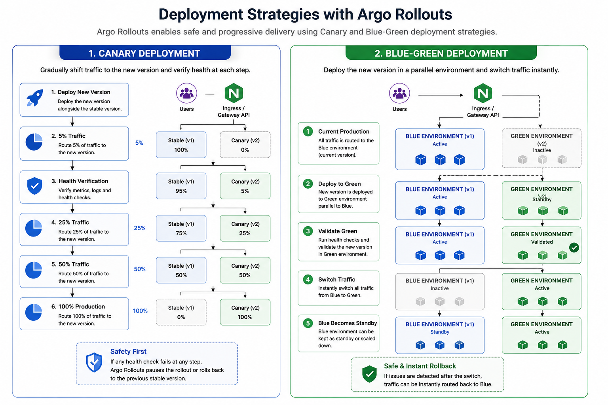

## Project Name

**Production-Inspired Platform Engineering on Google Kubernetes Engine (GKE)**

---
## Project Objective

This project demonstrates the design and implementation of a **production-inspired Platform Engineering solution** on **Google Kubernetes Engine (GKE)** using modern cloud-native technologies and GitOps practices.

Rather than focusing solely on deploying applications, the project emphasizes building the **underlying Kubernetes platform** that enables development teams to deploy applications securely, consistently and through automated workflows.

The platform incorporates Infrastructure as Code (IaC), GitOps, DevSecOps, observability, progressive delivery, autoscaling and cost optimization to reflect common enterprise platform engineering practices.

---
## Problem Statement

Many Kubernetes sample projects focus only on deploying containerized applications and often omit the operational capabilities required in real-world environments, such as:

* Infrastructure as Code
* GitOps-based deployments
* Platform security
* Policy enforcement
* Secret management
* Continuous Integration
* Progressive delivery
* Monitoring and alerting
* Autoscaling
* Cost visibility

This project addresses those gaps by implementing a production-inspired platform that demonstrates how Kubernetes infrastructure can be provisioned, managed, secured and operated using automation and declarative workflows.

---
## 📑 Table of Contents
- [🏗️ High-Level Architecture](#high-level-architecture)
- [🏛️ Project Architecture](#project-architecture)
  - [☁️ Infrastructure Layer](#infrastructure-layer)
  - [⚙️ Platform Layer](#platform-layer)
  - [🔨 CI Pipeline](#ci-pipeline)
  - [🚀 GitOps Deployment](#gitops-deployment)
  - [📦 Application Layer](#application-layer)
  - [🌐 Networking](#networking)
  - [🔄 Progressive Delivery](#progressive-delivery)
  - [🔒 Platform Security](#platform-security)
    - [🛡️ Image Security](#image-security)
    - [📦 Supply Chain Security](#supply-chain-security)
    - [📋 Policy Enforcement](#policy-enforcement)
    - [🔑 Secret Management](#secret-management)
    - [🔐 TLS Management](#tls-management)
  - [📈 Autoscaling](#autoscaling)
    - [📊 Horizontal Pod Autoscaler (HPA)](#horizontal-pod-autoscaler-hpa)
    - [⚡ KEDA](#keda)
  - [📊 Observability](#observability)
- [🧩 Platform Services](#platform-services)
- [⚠️ Challenges Encountered](#challenges-encountered)
- [✅ Project Outcomes](#project-outcomes)
- [🛠️ Technology Stack](#technology-stack)
  - [☁️ Cloud](#cloud)
  - [🏗️ Infrastructure](#infrastructure)
  - [📦 Container Platform](#container-platform)
  - [🚀 CI/CD](#cicd)
  - [🛡️ DevSecOps](#devsecops)
  - [📊 Observability](#observability)
  - [🌐 Networking](#networking)
  - [🗄️ Databases](#databases)
- [🎓 Key Learning Outcomes](#key-learning-outcomes)

---
## High-Level Architecture

  

---
## Project Architecture

The platform follows a layered architecture consisting of infrastructure, platform services, application workloads, and operational tooling.

### Infrastructure Layer

Infrastructure is provisioned using **Terraform** with reusable modules.

Resources include:

* Virtual Private Cloud (VPC)
* Private Google Kubernetes Engine Cluster
* Artifact Registry
* Cloud Storage
* IAM Roles
* Service Accounts
* Workload Identity

The modular design allows infrastructure to be reusable, scalable and easier to maintain.

---
### Platform Layer

The Kubernetes platform provides the foundational services required by applications.

Core platform services include:

* Argo CD
* External Secrets Operator
* Kyverno
* cert-manager
* Gateway API
* NGINX Gateway Fabric
* KEDA
* kube-prometheus-stack
* Kubecost

Dedicated namespaces are used to isolate workloads and platform components.

---
### CI Pipeline

Continuous Integration is implemented using **GitHub Actions**.

Every code change triggers an automated pipeline that performs:

* Source checkout
* Dependency installation
* Unit testing
* Docker image build
* Trivy vulnerability scanning
* SBOM generation
* Cosign image signing
* Image push to Artifact Registry
* GitOps repository update

This ensures only verified container images are deployed.

---
### GitOps Deployment

Continuous Delivery is implemented using **Argo CD**.

Instead of deploying directly from the CI pipeline, GitHub Actions updates the GitOps repository.

Argo CD continuously monitors the repository and automatically synchronizes Kubernetes resources.

Benefits include:

* Declarative deployments
* Version-controlled infrastructure
* Automatic reconciliation
* Drift detection
* Simplified rollback

---
### Application Layer

The platform deploys a sample microservices application consisting of:

* Vote Service
* Worker Service
* Result Service
* Redis
* PostgreSQL

Application manifests are managed using:

* Helm
* Kustomize
* GitOps

This structure supports environment-specific configuration while maintaining reusable base manifests.

---
### Networking

External traffic is managed using the Kubernetes **Gateway API** together with **NGINX Gateway Fabric**.

Networking capabilities include:

* HTTP routing
* HTTPS termination
* Load balancing
* Traffic management
* TLS certificate integration

TLS certificates are automatically issued using **cert-manager** with **Cloudflare DNS validation**.

---
### Progressive Delivery

Application deployments use **Argo Rollouts** for canary releases and Blue-Green

Typical rollout progression:

If deployment health checks fail, the rollout pauses or can be rolled back before affecting all users.

---
### Platform Security

Security is integrated throughout the platform.

#### Image Security

* Trivy vulnerability scanning

#### Supply Chain Security

* SBOM generation
* Cosign image signing

#### Policy Enforcement

Kyverno validates Kubernetes resources by enforcing policies such as:

* Required labels
* Resource requests and limits
* Liveness probes
* Readiness probes
* Non-root containers
* Approved image registries

#### Secret Management

External Secrets Operator synchronizes secrets from **Google Secret Manager** and **vault** into Kubernetes.

#### TLS Management

cert-manager automates certificate provisioning and renewal.

---
### Autoscaling

The platform implements multiple autoscaling mechanisms.

#### Horizontal Pod Autoscaler (HPA)

Scales application pods based on CPU utilization.

#### KEDA

Worker services scale dynamically based on Redis queue length, enabling event-driven autoscaling.

---
### Observability

Platform monitoring is implemented using **kube-prometheus-stack**.

Components include:

* Prometheus
* Grafana
* Alertmanager

Monitoring capabilities include:

* ServiceMonitors
* Prometheus Rules
* Alerting
* Application metrics
* Kubernetes metrics

Kubecost provides visibility into Kubernetes resource utilization and estimated infrastructure costs.

---
## Platform Services

The platform includes the following operational services:

| Component            | Purpose                       |
| -------------------- | ----------------------------- |
| Argo CD              | GitOps Continuous Delivery    |
| Gateway API          | Kubernetes traffic management |
| NGINX Gateway Fabric | Gateway API implementation    |
| Kyverno              | Kubernetes policy enforcement |
| External Secrets     | Secret synchronization        |
| cert-manager         | TLS certificate automation    |
| KEDA                 | Event-driven autoscaling      |
| Prometheus           | Metrics collection            |
| Grafana              | Dashboards and visualization  |
| Alertmanager         | Alert routing                 |
| Kubecost             | Cost monitoring               |
| Argo Rollouts        | Progressive delivery          |

---
## Challenges Encountered

During implementation several practical challenges were encountered, including:

* Google Cloud quota limitations
* Private GKE networking configuration
* Gateway API implementation
* Kyverno policy debugging
* External Secrets synchronization
* Kubernetes scheduling issues
* Node affinity and taints
* Persistent storage provisioning
* Progressive delivery configuration

These issues were resolved through Kubernetes event analysis, controller logs, Terraform state inspection, and Google Cloud troubleshooting.

---
## Project Outcomes

This project successfully demonstrates a production-inspired Kubernetes platform capable of automating:

* Infrastructure provisioning
* Kubernetes cluster management
* Continuous Integration
* GitOps deployments
* Progressive delivery
* Secret management
* Policy enforcement
* Monitoring and alerting
* Event-driven autoscaling
* Cost visibility

The entire platform is managed using declarative Infrastructure as Code and GitOps principles.

---
## Technology Stack

### Cloud

* Google Cloud Platform (Primary)
* Amazon Web Services (Supporting)

### Infrastructure

* Terraform

### Container Platform

* Docker
* Kubernetes
* Helm
* Kustomize

### CI/CD

* GitHub Actions
* Argo CD
* Argo Rollouts

### DevSecOps

* Trivy
* Cosign
* SBOM
* Kyverno
* External Secrets Operator

### Observability

* Prometheus
* Grafana
* Alertmanager
* Kubecost

### Networking

* Gateway API
* NGINX Gateway Fabric
* cert-manager
* Cloudflare DNS

### Databases

* PostgreSQL
* Redis

---
## Key Learning Outcomes

This project provided practical experience in:

* Platform Engineering
* Kubernetes Administration
* Infrastructure as Code
* GitOps
* DevSecOps
* Kubernetes Networking
* Policy Enforcement
* Progressive Delivery
* Observability
* Kubernetes Cost Optimization
* Production-inspired Platform Design

---
